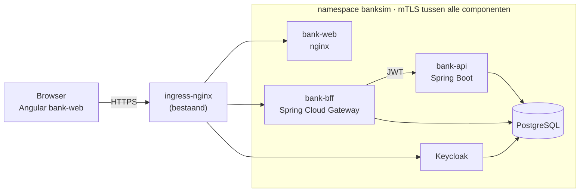

# BankSim

BankSim is een simulatie van internetbankieren voor 10 fictieve huishoudens met ongeveer 5 jaar realistische transactiehistorie. Een admin kan de datum van de simulatie verzetten; alle rekeninghouders zien hun rekeningen dan alsof het die dag is.

> **Status:** fase 1 t/m 7 zijn klaar: alle schermen en API's uit het functioneel ontwerp werken, met inloggen via Keycloak, mTLS, NetworkPolicies, een versleutelde BFF-sessie, rate limiting en vijf jaar fake data, en een Playwright-suite test alle scenario's in Chromium, Firefox en WebKit. Nog te doen: CI en supply-chain-scans (fase 8).

## Documentatie

| Document | Inhoud |
| --- | --- |
| [Functioneel ontwerp](doc/functioneel-ontwerp.md) | Schermen met schetsen, functionaliteit, validaties, fake data en beantwoorde open punten |
| [Technisch ontwerp](doc/technisch-ontwerp.md) | Architectuur, API, datamodel, security, OWASP Top 10:2025, resilience, teststrategie en deployment |

## Functionaliteit

- **Overzicht**: na het inloggen ziet een klant de eigen betaal- en spaarrekening met saldo.
- **Betaalrekening**: transacties per datum, 50 tegelijk met "Toon meer", uitklapbare details, en uitgebreid zoeken (tekst, bedrag, transactietype, in/uit).
- **Betalen**: alleen naar bekende contacten, met controlescherm. Rood staan is niet toegestaan.
- **Spaarrekening**: 3% rente per jaar, dagelijks berekend en maandelijks bijgeschreven; inleggen en opnemen via het Overschrijven-scherm.
- **Admin**: overzicht van alle rekeninghouders, alleen-lezen inzage in hun transacties en het instellen van de simulatiedatum.
- **Fake data**: deterministische generator voor 10 huishoudens van 1 oktober 2021 t/m 31 december 2026.

Zie het [functioneel ontwerp](doc/functioneel-ontwerp.md) voor de schermen en regels.

## Architectuur



| Component | Rol |
| --- | --- |
| `bank-web` | Angular-app met de klant- en adminschermen |
| `bank-bff` | Backend-for-Frontend: logt in bij Keycloak, houdt tokens server-side, sessie via HttpOnly-cookie |
| `bank-api` | Businesslogica, grootboek en autorisatie; valideert elk JWT zelf |
| `bank-migrate` | Flyway-migraties als Kubernetes Job |
| `bank-datagen` | Generator van de fake data en Keycloak-gebruikers |
| Keycloak | Gebruikers, rollen `klant` en `admin` (officiële image, in `banksim`) |
| PostgreSQL | Grootboek, contacten, sessies, audit log en Keycloak-database (officiële image, in `banksim`) |

Belangrijkste principes (details in het [technisch ontwerp](doc/technisch-ontwerp.md)):

- **Atomaire overboekingen**: elke geldbeweging gaat via één `LedgerService`; af- en bijschrijving in dezelfde databasetransactie (hoofdstuk 6).
- **BigDecimal**: bedragen zijn overal `BigDecimal`, `NUMERIC(19,2)` en in JSON een string; in de frontend `big.js` (hoofdstuk 5).
- **Zero trust**: BFF met OIDC, JWT-validatie in de API, mTLS in de applicaties met een eigen BankSim-CA (elke service controleert wie haar aanroept), default-deny NetworkPolicies (hoofdstuk 10).
- **OWASP Top 10:2025**: maatregelen per categorie A01–A10 (hoofdstuk 11).
- **Resilience**: start zonder database of Keycloak, timeouts, circuit breakers, idempotente betalingen (hoofdstuk 12).

## Techstack

Java 21 · Spring Boot · Spring Cloud Gateway · Keycloak · PostgreSQL · Angular · TypeScript · Playwright · kind (OrbStack) · ingress-nginx · Helm

## Projectstructuur

```text
banksim/
├── doc/          functioneel en technisch ontwerp
├── backend/      Maven multi-module: bank-domain, bank-api, bank-bff, bank-migrate, bank-datagen
├── frontend/     Angular-app bank-web
├── e2e/          Playwright-tests
└── deploy/       install- en uninstall-scripts, Helm-chart
```

## Aan de slag

BankSim wordt geïnstalleerd in een eigen namespace `banksim` in het bestaande kind-cluster `single-node` (OrbStack). Keycloak en PostgreSQL draaien in dezelfde namespace; buiten de namespace wordt niets geïnstalleerd. Het cluster moet ingress-nginx hebben op poort 80/443.

Vereisten: Java 21, Maven 3.9, Node 22 LTS, OrbStack (of Docker), kind (≥ 0.31), kubectl, Helm en openssl.

```bash
deploy/scripts/install.sh           # images bouwen, certificaten en secrets maken, alles installeren
deploy/scripts/trust-ca.sh          # optioneel: BankSim-CA vertrouwen in de macOS-sleutelhanger
deploy/scripts/uninstall.sh         # namespace banksim met alle data verwijderen
deploy/scripts/uninstall.sh --purge # ook de images en de lokale CA verwijderen
```

De scripts werken alleen op de kubectl-context `kind-single-node`, tenzij je met `--context` een andere kiest. `install.sh` kun je veilig opnieuw draaien. `make install` en `make uninstall` roepen dezelfde scripts aan.

Daarna is de applicatie bereikbaar op <https://bank.localtest.me>; Keycloak draait op <https://auth.localtest.me>. Er zijn 10 klanten (`jdevries`, `sbakker`, `melamrani`, `ljansen`, `pvisser`, `fyilmaz`, `dsmit`, `edeboer`, `rmulder`, `nhendriks`) en een `beheerder`. De wachtwoorden staan in een Kubernetes Secret dat bij de installatie wordt gemaakt; `install.sh` toont hoe je ze ophaalt. Zie [hoofdstuk 15 van het technisch ontwerp](doc/technisch-ontwerp.md#15-deployment-op-kind) voor details.

## Testen

```bash
make test       # backend: unit, integratie (Testcontainers), architectuur, contract en mutation tests
deploy/scripts/install.sh --e2e   # installeren met een ruimere login-limiet voor de e2e-suite
make e2e-install                  # eenmalig: Playwright en browsers
make e2e        # Playwright e2e-tests tegen de installatie in namespace banksim
deploy/scripts/reset-data.sh   # testdata terugzetten naar de vaste beginstand
```

De backendtests voorkomen regressie op onder meer geldberekeningen, gelijktijdige overboekingen, toegangscontrole en uitval van database of Keycloak. De Playwright-tests dekken alle scenario's uit het functioneel ontwerp; ze zetten de testdata zelf terug en halen de wachtwoorden uit het Secret. Zie hoofdstuk 13 en 14 van het [technisch ontwerp](doc/technisch-ontwerp.md).
