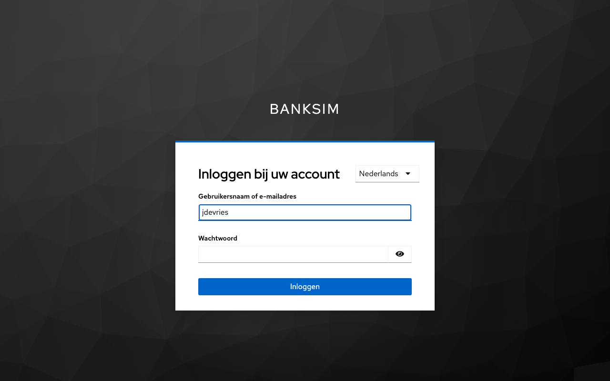
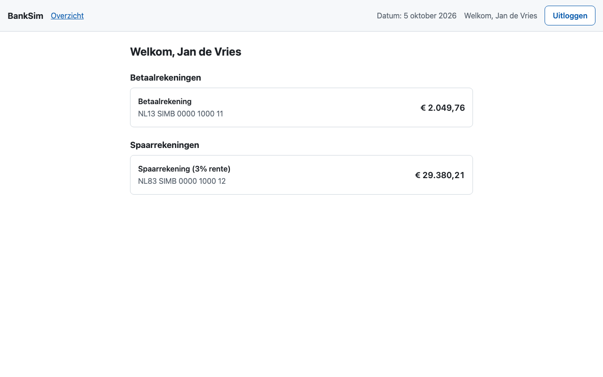
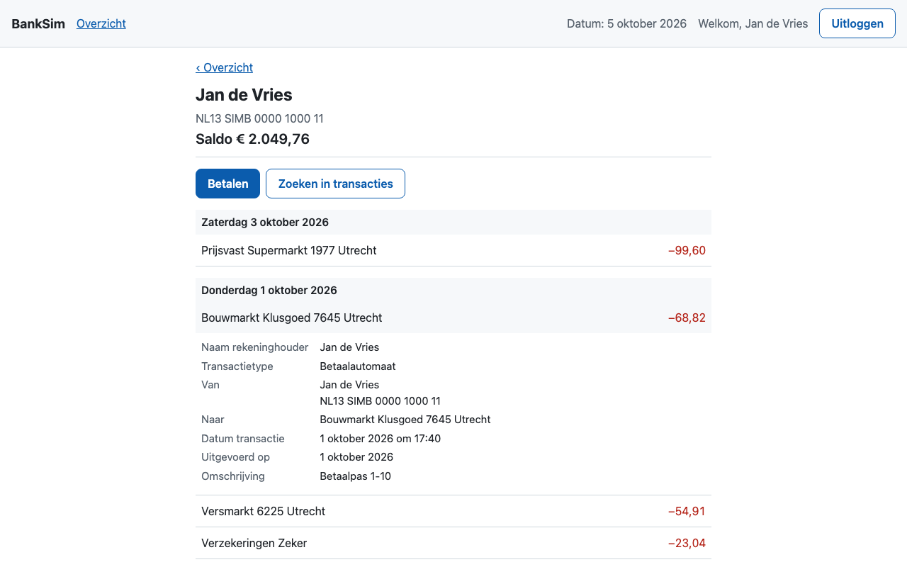
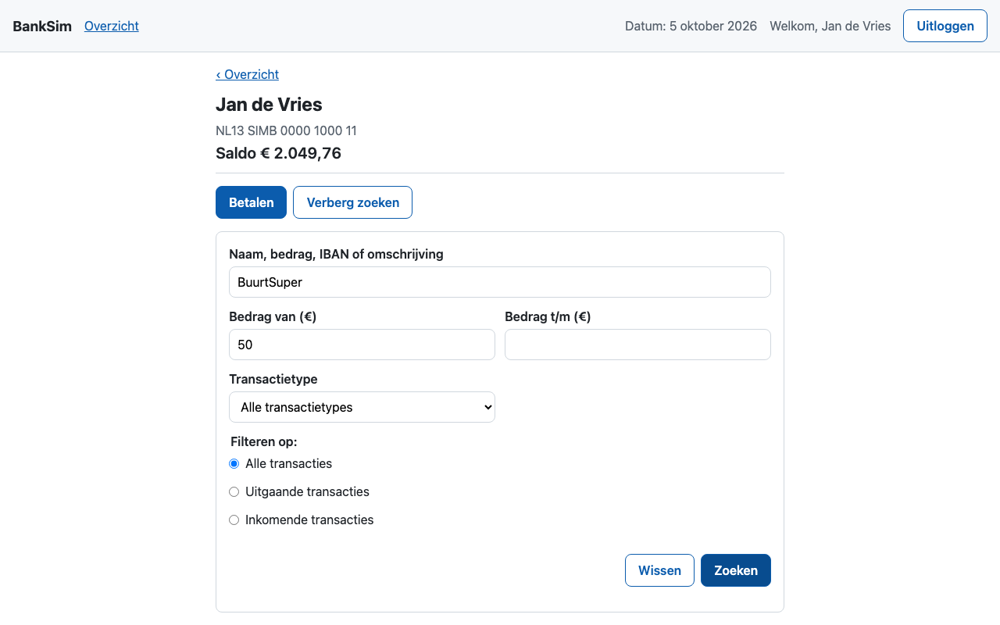
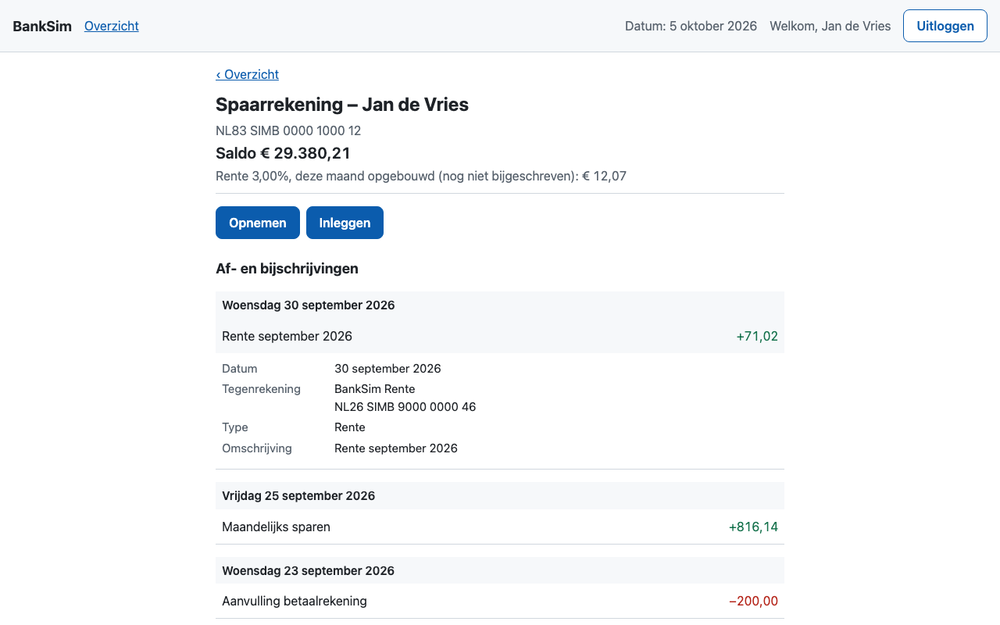
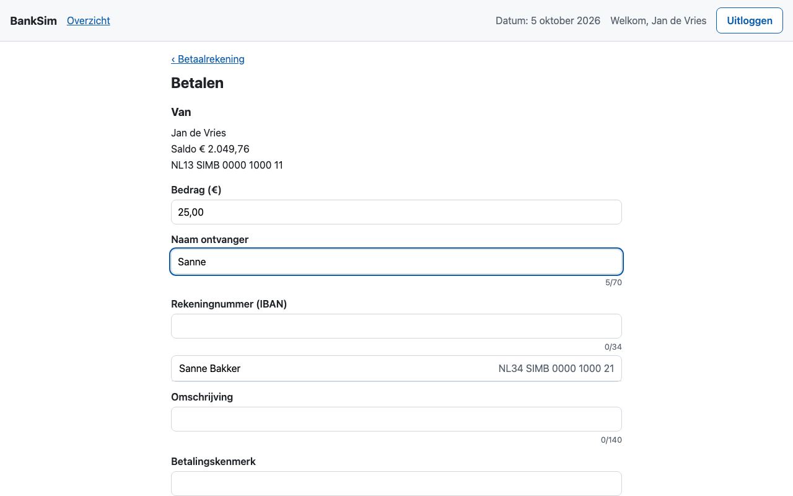
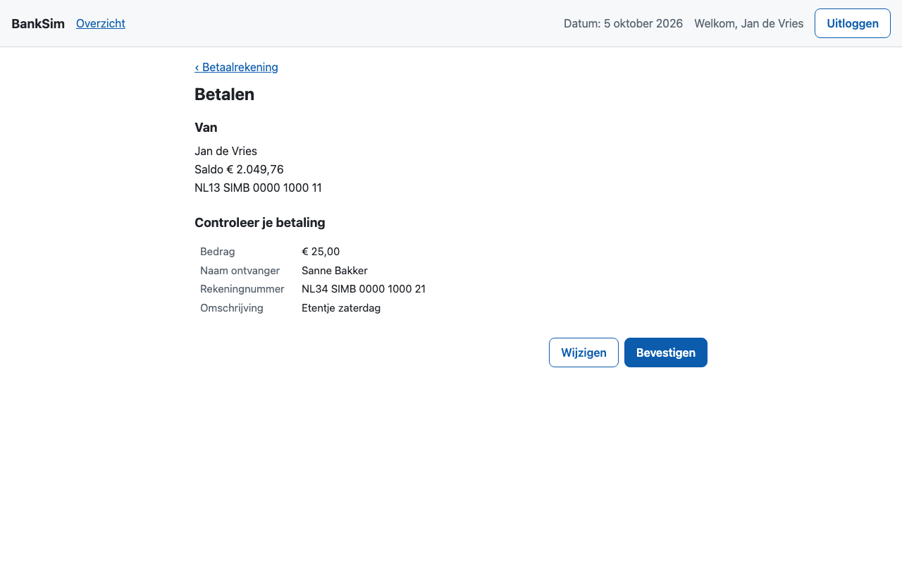
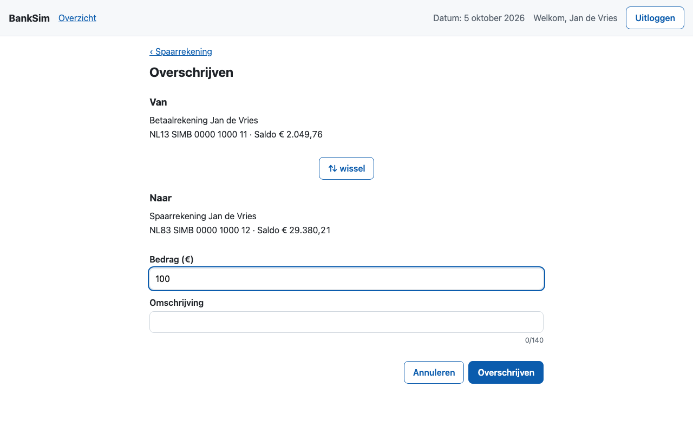
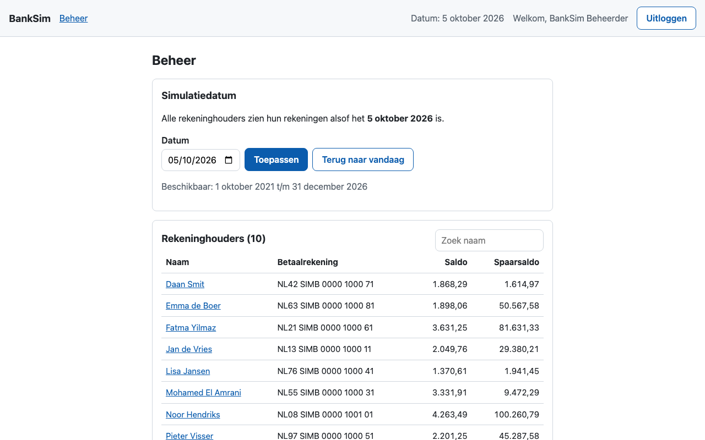
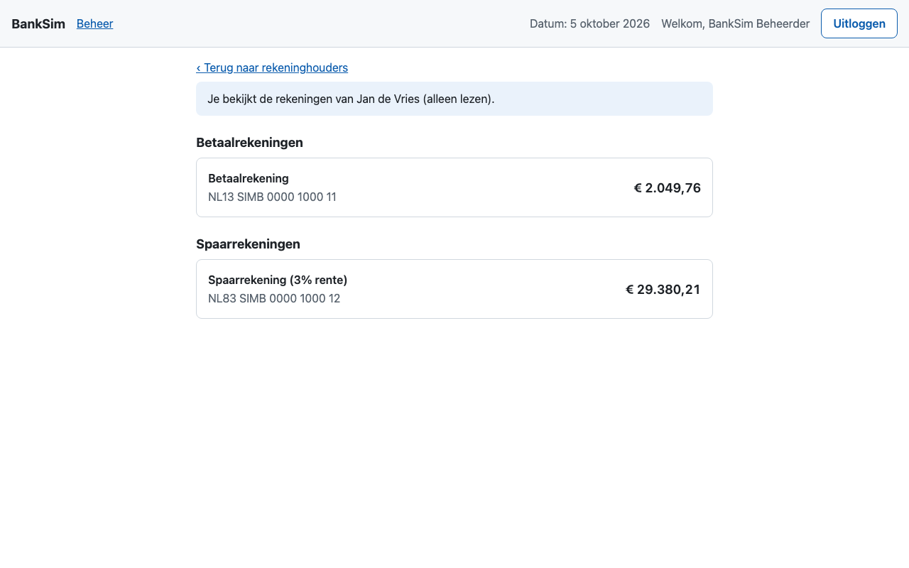

# BankSim-handleiding

Deze handleiding brengt je in een kwartier van een lege machine naar een werkende BankSim: installeren, inloggen als klant, rekeningen bekijken en geld overmaken, en als beheerder de simulatiedatum verzetten en meekijken bij klanten.

BankSim is een gesimuleerde bank. Tien fictieve huishoudens hebben elk een betaal- en een spaarrekening met vijf jaar aan nepdata (oktober 2021 tot en met december 2026). Er is geen echt geld en er zijn geen echte personen of bedrijven. Achtergrond staat in het [functioneel ontwerp](functioneel-ontwerp.md) en het [technisch ontwerp](technisch-ontwerp.md); de [README](../README.md) geeft een kort overzicht voor ontwikkelaars.

## Inhoud

1. [Vereisten](#1-vereisten)
2. [Installeren](#2-installeren)
3. [Wachtwoorden en testgebruikers](#3-wachtwoorden-en-testgebruikers)
4. [Inloggen als klant](#4-inloggen-als-klant)
5. [Rekeningen bekijken](#5-rekeningen-bekijken)
6. [Geld overmaken](#6-geld-overmaken)
7. [Inloggen als beheerder](#7-inloggen-als-beheerder)
8. [Beheerder: bekijken en aanpassen](#8-beheerder-bekijken-en-aanpassen)
9. [Uitloggen en sessies](#9-uitloggen-en-sessies)
10. [Data terugzetten](#10-data-terugzetten)
11. [Verwijderen](#11-verwijderen)
12. [Problemen oplossen](#12-problemen-oplossen)

---

## 1. Vereisten

BankSim draait in een eigen namespace `banksim` in een bestaand lokaal Kubernetes-cluster. Daarbuiten wordt niets geïnstalleerd.

**Cluster**

- [OrbStack](https://orbstack.dev) (of Docker Desktop) met een [kind](https://kind.sigs.k8s.io)-cluster `single-node`; de kubectl-context heet `kind-single-node`.
- [ingress-nginx](https://kubernetes.github.io/ingress-nginx/) in dat cluster, bereikbaar op poort 80 en 443 van je machine.

Controleer het cluster met:

```bash
kubectl --context kind-single-node get nodes
kubectl --context kind-single-node -n ingress-nginx get deployment ingress-nginx-controller
```

Beide commando's moeten een resultaat geven zonder foutmelding.

**Gereedschap op je machine**

| Tool | Waarvoor |
| --- | --- |
| Java 21 (JDK) | De backend bouwen; `keytool` voor de certificaten |
| Node.js 24 (of 22.22.3+) | De Angular-frontend bouwen |
| kind, kubectl, Helm 4 | Images in het cluster laden en installeren |
| openssl, jq, git, curl | Certificaten, scripts en rooktests |

Maven hoef je niet te installeren: de backend gebruikt de wrapper `backend/mvnw`.

**Netwerk**

De adressen `bank.localtest.me` en `auth.localtest.me` verwijzen altijd naar je eigen machine (127.0.0.1). Je hoeft `/etc/hosts` niet aan te passen.

---

## 2. Installeren

Ga naar de map van het project en start de installatie:

```bash
deploy/scripts/install.sh
```

Het script doet in één keer:

1. controleert de vereisten en het cluster;
2. bouwt de images van backend en frontend en laadt ze in het kind-cluster;
3. maakt een eigen certificaatautoriteit (de BankSim-CA) en een certificaat per onderdeel;
4. maakt willekeurige wachtwoorden en sleutels aan als Kubernetes Secrets;
5. installeert PostgreSQL, Keycloak, de backend en de frontend met Helm;
6. vult de database met de nepdata en maakt de gebruikers aan in Keycloak;
7. draait rooktests: zijn de pagina's bereikbaar, werkt inloggen, en zijn de beveiligingsmaatregelen actief?

De eerste keer duurt dit 5 tot 10 minuten. Elke regel met een groen vinkje (✓) is een geslaagde stap. Aan het eind toont het script de adressen, de gebruikersnamen en hoe je de wachtwoorden ophaalt.

Je kunt het script veilig opnieuw draaien; bestaande wachtwoorden en data blijven staan. Handige opties:

| Optie | Effect |
| --- | --- |
| `--skip-build` | Geen nieuwe images bouwen, alleen de installatie bijwerken |
| `--skip-smoke-tests` | Rooktests overslaan |
| `--rotate-certs` | Alle certificaten vernieuwen |
| `--context <naam>` | Een ander kind-cluster gebruiken |

### Certificaatwaarschuwing voorkomen (aanbevolen)

De website gebruikt een certificaat van de BankSim-CA, die je browser niet kent. Laat macOS die CA vertrouwen:

```bash
deploy/scripts/trust-ca.sh
```

macOS vraagt om je wachtwoord of Touch ID. Daarna vertrouwen Safari en Chrome de BankSim-sites. Firefox heeft een eigen certificaatopslag: importeer daar `deploy/.secrets/certs/ca.crt` via *Instellingen → Privacy & Beveiliging → Certificaten bekijken → Autoriteiten → Importeren*.

Sla je deze stap over, dan toont de browser een waarschuwing. Accepteer die dan voor **zowel** `https://bank.localtest.me` **als** `https://auth.localtest.me`, anders loopt het inloggen vast.

---

## 3. Wachtwoorden en testgebruikers

De wachtwoorden worden bij de installatie willekeurig gemaakt en staan in het Secret `banksim-keycloak`. Haal ze op met:

```bash
# Wachtwoord van alle klanten
kubectl --context kind-single-node -n banksim get secret banksim-keycloak \
  -o jsonpath='{.data.klant-password}' | base64 -d; echo

# Wachtwoord van de beheerder
kubectl --context kind-single-node -n banksim get secret banksim-keycloak \
  -o jsonpath='{.data.beheerder-password}' | base64 -d; echo
```

Alle tien klanten hebben hetzelfde wachtwoord.

| Gebruikersnaam | Naam | Situatie |
| --- | --- | --- |
| `jdevries` | Jan de Vries | Alleenstaand, werknemer, huurwoning |
| `sbakker` | Sanne Bakker | Stel, werknemer, koopwoning |
| `melamrani` | Mohamed El Amrani | Gezin met drie kinderen, huurwoning |
| `ljansen` | Lisa Jansen | Alleenstaand, werkt in het onderwijs |
| `pvisser` | Pieter Visser | Gepensioneerd stel |
| `fyilmaz` | Fatma Yilmaz | Gezin met kinderopvang, koopwoning |
| `dsmit` | Daan Smit | Zzp'er |
| `edeboer` | Emma de Boer | Stel |
| `rmulder` | Ruud Mulder | Gepensioneerd, alleenstaand |
| `nhendriks` | Noor Hendriks | Gezin, hoog inkomen |
| `beheerder` | BankSim Beheerder | Beheerder (eigen wachtwoord) |

Tip: `jdevries` en `sbakker` staan in elkaars contacten. Daarmee probeer je makkelijk een betaling tussen twee klanten uit.

---

## 4. Inloggen als klant

1. Open <https://bank.localtest.me>. Je wordt doorgestuurd naar het inlogscherm.
2. Vul een gebruikersnaam in (bijvoorbeeld `jdevries`) en het klantwachtwoord.
3. Klik op **Inloggen**.



Rechtsboven in het inlogscherm kies je de taal (Nederlands of Engels).

Na het inloggen kom je op het **Overzicht**.

> **Let op:** na vijf foute wachtwoorden blokkeert het systeem de gebruiker tijdelijk (eerst één minuut, bij herhaling langer, tot maximaal een kwartier). Wacht dan even en probeer het opnieuw.

---

## 5. Rekeningen bekijken

### Overzicht

Het Overzicht toont je betaalrekening en je spaarrekening, elk met rekeningnummer (IBAN) en saldo. Klik op een rekening om de transacties te zien.



De balk bovenaan is op elk scherm hetzelfde:

- **BankSim** en **Overzicht** brengen je terug naar het Overzicht.
- **Datum: …** is de *simulatiedatum*: de dag waarop de bank "nu" staat. Je ziet alleen transacties tot en met die dag, en het saldo van die dag. De beheerder kan deze datum verzetten (zie [hoofdstuk 8](#8-beheerder-bekijken-en-aanpassen)).
- **Welkom, …** toont wie er is ingelogd.
- **Uitloggen** beëindigt je sessie.

### Betaalrekening

Bovenaan staan je naam, het rekeningnummer en het saldo. Daaronder de knoppen **Betalen** en **Zoeken in transacties**, en de lijst met transacties, de nieuwste bovenaan.



- Transacties zijn per dag gegroepeerd onder een grijze **datumregel** (bijvoorbeeld *Zaterdag 3 oktober 2026*).
- Afschrijvingen staan in rood met een minteken (**−99,60**), bijschrijvingen, zoals je salaris, in groen met een plusteken.
- **Klik op een transactie** om de details te zien: naam rekeninghouder, transactietype, van en naar (met rekeningnummer), datum en tijd, uitvoerdatum, en indien aanwezig omschrijving, betalingskenmerk en extra omschrijving. Klik nog een keer om de details te sluiten.
- Bij een betaling met de pinpas (*Betaalautomaat*) staat bij **Naar** alleen de naam van de winkel, zonder rekeningnummer.
- Er worden eerst 50 transacties getoond. Klik onderaan op **Toon meer** voor de volgende 50. Als alles getoond is, verdwijnt de knop.

### Zoeken in transacties

Klik op **Zoeken in transacties**. Er verschijnt een zoekformulier en de knop heet nu **Verberg zoeken**.



| Veld | Gebruik |
| --- | --- |
| Naam, bedrag, IBAN of omschrijving | Vrije tekst, bijvoorbeeld `BuurtSuper`, `Huur` of een deel van een rekeningnummer |
| Bedrag van (€) / Bedrag t/m (€) | Bereik, bijvoorbeeld van `50` t/m `150`; gebruik een komma voor centen (`12,50`) |
| Transactietype | Online bankieren, iDEAL \| Wero, Betaalautomaat, Incasso, Geldautomaat, Overschrijving of Verzamelbetaling |
| Filteren op | Alle transacties, alleen uitgaande of alleen inkomende |

Klik op **Zoeken** om te filteren en op **Wissen** om alle velden leeg te maken en weer alle transacties te zien. Is "Bedrag van" groter dan "Bedrag t/m", dan krijg je daar een melding van. Vindt de zoekopdracht niets, dan staat er *Geen transacties gevonden.*

### Spaarrekening

Klik op het Overzicht op de spaarrekening.



- Bovenaan staan saldo en de **lopende rente**: hoeveel rente je deze maand al hebt opgebouwd. De spaarrente is 3% per jaar en wordt op de laatste dag van elke maand bijgeschreven (*Rente september 2026*).
- De lijst toont per transactie de omschrijving en het bedrag, gegroepeerd per dag. Tussen de jaren staat een **jaartalregel** (bijvoorbeeld *2025*).
- Klik op een transactie voor de details: datum, tegenrekening, type en omschrijving.
- Met **Opnemen** en **Inleggen** verplaats je geld tussen spaar- en betaalrekening (zie hieronder).

---

## 6. Geld overmaken

### Betalen

Ga naar de betaalrekening en klik op **Betalen**.



1. Vul het **Bedrag (€)** in, met een komma voor centen (`25,00`).
2. Typ een deel van de **Naam ontvanger** of van het **Rekeningnummer (IBAN)**. Onder de velden verschijnen suggesties uit je contacten; klik er een aan om naam en rekeningnummer in één keer in te vullen.
3. Vul eventueel **Omschrijving**, **Betalingskenmerk** en **Extra omschrijving** in. Onder elk veld zie je hoeveel tekens je nog mag gebruiken (70, 34, 140, 25 en 35).
4. Klik op **Volgende**. Je ziet een controlescherm.



5. Klopt alles, klik dan op **Bevestigen**. Wil je nog iets aanpassen, klik dan op **Wijzigen**.

Je komt terug op de betaalrekening met de melding *Betaling van € 25,00 aan Sanne Bakker is uitgevoerd.* De betaling staat bovenaan de lijst en het saldo is lager. Log in als de ontvanger (bijvoorbeeld `sbakker`) om de bijschrijving te zien.

Goed om te weten:

- **Je kunt niet rood staan.** Is het bedrag hoger dan je saldo, dan waarschuwt het formulier al (*Dit is meer dan je saldo.*) en weigert de bank de betaling. Ook geplande toekomstige afschrijvingen tellen mee, dus soms is iets minder dan het saldo al te veel.
- **Alleen rekeningen bij BankSim.** Betalen naar een rekeningnummer dat BankSim niet kent geeft *Naar dit rekeningnummer kan niet worden betaald.*
- **Niet dubbel betalen.** Klik je per ongeluk twee keer op Bevestigen, of valt de verbinding even weg, dan wordt de betaling toch maar één keer uitgevoerd.

### Inleggen en opnemen (spaarrekening)

Ga naar de spaarrekening en klik op **Inleggen** (van betaal- naar spaarrekening) of **Opnemen** (van spaar- naar betaalrekening). Je komt op het scherm **Overschrijven**.



1. Controleer **Van** en **Naar**. Met de knop **⇅ wissel** draai je ze om.
2. Vul het **Bedrag (€)** in en eventueel een **Omschrijving**.
3. Klik op **Overschrijven**.

Je komt terug op de spaarrekening; de overschrijving staat bovenaan en beide saldi zijn bijgewerkt. Ook hier geldt: geen van beide rekeningen kan onder nul komen.

---

## 7. Inloggen als beheerder

Log uit als klant (of gebruik een privévenster) en ga naar <https://bank.localtest.me>. Log in met gebruikersnaam `beheerder` en het beheerderswachtwoord. Je komt direct op het scherm **Beheer**.

---

## 8. Beheerder: bekijken en aanpassen



### Simulatiedatum verzetten

De simulatiedatum bepaalt voor **alle** klanten welke dag het "nu" is in de bank: welke transacties zichtbaar zijn en welk saldo ze hebben. Zo kun je terug of vooruit in de tijd.

1. Kies een datum in het veld **Datum**. Toegestaan is 1 oktober 2021 tot en met 31 december 2026 (staat onder het veld).
2. Klik op **Toepassen**. Je ziet *De simulatiedatum is nu …* en de datum rechtsboven verandert.
3. Met **Terug naar vandaag** gebruikt de bank weer de echte datum van vandaag.

Een klant die al is ingelogd, ziet de nieuwe datum na het vernieuwen van de pagina; het kan tot vijf seconden duren voordat de wijziging overal zichtbaar is.

Voorbeeld: zet de datum op 15 juli 2026 en log in als `jdevries`. Bovenaan staat *Datum: 15 juli 2026*, de nieuwste transactie is van die dag of eerder, en het saldo is dat van 15 juli.

### Rekeninghouders bekijken

Onder de simulatiedatum staat de tabel **Rekeninghouders** met van elke klant de naam, het rekeningnummer van de betaalrekening, het saldo en het spaarsaldo. Typ in **Zoek naam** om de lijst te filteren.

Klik op een naam om de rekeningen van die klant te bekijken.



- Bovenaan staat *Je bekijkt de rekeningen van … (alleen lezen).*
- Je ziet dezelfde schermen als de klant: overzicht, betaalrekening, spaarrekening, transactiedetails en zoeken.
- De knoppen **Betalen**, **Opnemen** en **Inleggen** ontbreken: een beheerder kan geen geld verplaatsen namens een klant.
- Met **‹ Terug naar rekeninghouders** (of **‹ Terug**) ga je terug.

Wat de beheerder kan aanpassen is dus alleen de simulatiedatum. Gebruikers, wachtwoorden en rollen staan in Keycloak; de beheerconsole van Keycloak is bewust niet via de browser bereikbaar.

---

## 9. Uitloggen en sessies

- Klik rechtsboven op **Uitloggen**. Je komt terug op het inlogscherm; de terugknop van de browser toont geen gegevens meer.
- Na 15 minuten zonder activiteit verloopt je sessie, en na 8 uur in ieder geval. Bij je volgende klik word je naar het inlogscherm gestuurd.

---

## 10. Data terugzetten

Heb je betalingen gedaan of de simulatiedatum verzet en wil je terug naar de beginstand?

```bash
deploy/scripts/reset-data.sh
```

Dit maakt alle data opnieuw aan. Omdat de generator altijd dezelfde startwaarde gebruikt, is het resultaat exact gelijk aan na de installatie. De simulatiedatum gaat terug naar vandaag. Met `--simulatiedatum 2026-10-05` zet je hem direct op een vaste dag. Gebruikers en wachtwoorden blijven hetzelfde.

---

## 11. Verwijderen

```bash
deploy/scripts/uninstall.sh          # vraagt om bevestiging
deploy/scripts/uninstall.sh -y       # zonder bevestiging
deploy/scripts/uninstall.sh --purge  # ook images, lokale certificaten en het CA-vertrouwen weg
```

Dit verwijdert de namespace `banksim` met alle data. De rest van het cluster blijft ongemoeid. Daarna kun je opnieuw installeren met `deploy/scripts/install.sh`.

---

## 12. Problemen oplossen

| Wat je ziet | Oorzaak en oplossing |
| --- | --- |
| Browser waarschuwt "verbinding is niet privé" | De BankSim-CA wordt niet vertrouwd. Draai `deploy/scripts/trust-ca.sh`, of accepteer de waarschuwing voor zowel `bank.localtest.me` als `auth.localtest.me`. |
| Inloggen blijft hangen of geeft een foutpagina na de waarschuwing | De waarschuwing is alleen voor één van de twee adressen geaccepteerd. Open <https://auth.localtest.me/realms/banksim> los, accepteer daar ook, en probeer opnieuw. |
| *Gebruikersnaam of wachtwoord ongeldig.* | Controleer het wachtwoord met de commando's uit [hoofdstuk 3](#3-wachtwoorden-en-testgebruikers). Na vijf fouten is de gebruiker tijdelijk geblokkeerd: wacht een minuut. |
| *Te veel verzoeken* / *Je hebt dit te vaak achter elkaar geprobeerd* | Beveiliging tegen misbruik: maximaal 10 inlogpogingen per minuut vanaf één adres en 20 betalingen per minuut per gebruiker. Wacht het aangegeven aantal seconden. |
| *De bank is even niet bereikbaar* met **Opnieuw proberen** | Een onderdeel herstart of is tijdelijk weg. Klik na een paar seconden op **Opnieuw proberen**. Blijft het, controleer dan de pods (hieronder). |
| *Deze boeking zou het saldo onder € 0,00 brengen, …* | Het bedrag is te hoog, ook gezien toekomstige afschrijvingen. Kies een lager bedrag of haal eerst geld van de spaarrekening. |
| *Naar dit rekeningnummer kan niet worden betaald.* | Het rekeningnummer bestaat niet bij BankSim. Kies een ontvanger uit de suggesties. |
| *Rekening is niet gevonden.* | Je opende de link naar een rekening die niet van jou is. Ga terug naar het Overzicht. |
| Pagina laadt helemaal niet | Controleer of alles draait: `kubectl --context kind-single-node -n banksim get pods`. Alle pods moeten `Running` en `1/1` zijn, behalve `bank-migrate` en `bank-datagen` (die zijn `Completed`). Draai zo nodig `deploy/scripts/install.sh` opnieuw. |
| `install.sh` meldt dat ingress-nginx ontbreekt of de context niet bestaat | Het cluster `single-node` draait niet of heeft geen ingress-nginx. Zie [hoofdstuk 1](#1-vereisten). |
