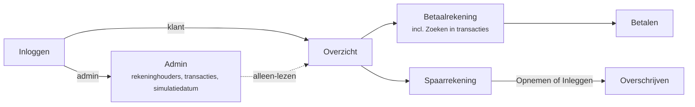

# BankSim – Functioneel ontwerp

Oct 5, 2026 · @Edwin

## Inleiding en navigatie

BankSim is een webapplicatie die internetbankieren nabootst voor 10 fictieve huishoudens, met ca. 5 jaar realistische transactiehistorie. Een admin kan de simulatiedatum verzetten, waarna alle schermen de situatie op die dag tonen.

De applicatie bestaat uit 7 schermen:

| Scherm | Bereikbaar vanuit | Doel |
| --- | --- | --- |
| Inloggen | Start | Rekeninghouder of admin meldt zich aan |
| Overzicht | Inloggen | Alle rekeningen van de gebruiker met saldo |
| Betaalrekening | Overzicht | Saldo, transactielijst, zoeken, betalen |
| Betalen | Betaalrekening | Geld overmaken naar een bekend contact |
| Spaarrekening | Overzicht | Saldo, rente, mutaties, inleggen/opnemen |
| Overschrijven | Spaarrekening | Geld verplaatsen tussen eigen betaal- en spaarrekening |
| Admin | Inloggen (admin-rol) | Rekeninghouders en hun transacties bekijken, simulatiedatum zetten |



Vanuit elk vervolgscherm brengt de terugknop linksboven de gebruiker een niveau terug.

In de schetsen hieronder staat `[ ... ]` voor een knop, `[____]` voor een invoerveld, `( )` voor een radiobutton, `▾` voor een combobox en `▸`/`▾` voor in- en uitgeklapte regels.

## Inloggen en Overzicht

Na het inloggen komt de gebruiker direct op het Overzichtscherm met al zijn betaal- en spaarrekeningen en hun saldo op de simulatiedatum.

```text
+------------------------------------------------+
|  BankSim                                       |
|                                                |
|  Gebruikersnaam  [______________________]      |
|  Wachtwoord      [______________________]      |
|                                                |
|                               [ Inloggen ]     |
+------------------------------------------------+
```

```text
+------------------------------------------------------+
|  BankSim            Datum: 5 oktober 2026  [Uitloggen]|
|------------------------------------------------------|
|  Welkom, J. de Vries                                 |
|                                                      |
|  Betaalrekeningen                                    |
|  +------------------------------------------------+  |
|  | Betaalrekening                       € 1.842,17 |  |
|  | NL12 SIMB 0123 4567 89                        > |  |
|  +------------------------------------------------+  |
|                                                      |
|  Spaarrekeningen                                     |
|  +------------------------------------------------+  |
|  | Spaarrekening (3% rente)            € 12.405,63 |  |
|  | NL45 SIMB 0987 6543 21                        > |  |
|  +------------------------------------------------+  |
+------------------------------------------------------+
```

**Functionaliteit**

- Inloggen met gebruikersnaam en wachtwoord; elke rekeninghouder uit de fake data krijgt een account, plus één admin-account.
- Na inloggen: rekeninghouder → Overzicht, admin → Admin scherm.
- Het Overzicht toont per rekening: soort, IBAN en saldo op de simulatiedatum.
- Klik op een betaalrekening opent het Betaalrekening scherm; klik op een spaarrekening opent het Spaarrekening scherm.
- De kopbalk toont op elk scherm de actuele simulatiedatum, zodat duidelijk is welke dag wordt nagebootst.

## Betaalrekening scherm

Het scherm toont bovenaan rekeninghouder, IBAN en saldo, daaronder de knoppen Betalen en Zoeken, en een transactielijst gegroepeerd per datum die per 50 regels wordt bijgeladen.

```text
+--------------------------------------------------------+
| < Overzicht                     Datum: 5 oktober 2026  |
|--------------------------------------------------------|
|  J. de Vries                                           |
|  NL12 SIMB 0123 4567 89                                |
|  Saldo                                     € 1.842,17  |
|                                                        |
|  [ Betalen ]   [ Zoeken in transacties ]               |
|--------------------------------------------------------|
|  Vrijdag 2 oktober 2026                                |
|  ▸ Albert Heijn 1234 Utrecht                   -63,48  |
|  ▸ Werkgever B.V.                           +3.215,00  |
|--------------------------------------------------------|
|  Donderdag 1 oktober 2026                              |
|  ▾ Woningstichting Thuis                     -812,40  |
|  .----------------------------------------------------.|
|  | J. de Vries                                        ||
|  | Transactietype:   Incasso                          ||
|  | Transactie:                                        ||
|  |   Van:  J. de Vries                                ||
|  |         NL12 SIMB 0123 4567 89                     ||
|  |   Naar: Woningstichting Thuis                      ||
|  |         NL77 SIMB 0555 1212 00                     ||
|  | Datum transactie: 1 oktober 2026 om 06:02          ||
|  | Uitgevoerd op:    1 oktober 2026                   ||
|  '----------------------------------------------------'|
|  ▸ Eneco                                      -148,00  |
|  ▸ Spaarrekening J. de Vries                  -250,00  |
|                                                        |
|                    [ Toon meer ]                       |
+--------------------------------------------------------+
```

**Kopgedeelte**

- Naam van de rekeninghouder.
- IBAN van de betaalrekening, in blokken van 4 tekens.
- Saldo (konto) op de simulatiedatum, in euro met 2 decimalen.

**Transactielijst**

- Gesorteerd van nieuw naar oud; alleen transacties t/m de simulatiedatum.
- Elke nieuwe datum begint met een datumregel (bijv. "Vrijdag 2 oktober 2026").
- Een transactieregel toont de naam van de tegenrekeninghouder en het bedrag: afschrijving negatief (-), bijschrijving positief (+).
- Bij openen worden de eerste 50 transactieregels opgehaald. "Toon meer" haalt de volgende 50 op en voegt ze onderaan toe; valt een datum over de grens, dan loopt de groep gewoon door zonder dubbele datumregel. De knop verdwijnt als er niets meer is.
- Datumregels tellen niet mee in de 50.

**Uitklapdetails**

Klikken op een transactieregel klapt de details uit; nogmaals klikken klapt ze in. Getoonde velden:

| Veld | Inhoud |
| --- | --- |
| Naam rekeninghouder | Naam van de eigenaar van deze rekening |
| Transactietype | Online bankieren, iDEAL \| Wero, Betaalautomaat, Incasso, Geldautomaat, Overschrijving of Verzamelbetaling |
| Van | Naam rekeninghouder + IBAN |
| Naar | Naam rekeninghouder + IBAN (mag ontbreken bij Betaalautomaat) |
| Datum transactie | "3 oktober 2026 om 13:26" |
| Uitgevoerd op | "3 oktober 2026" |

Omschrijving en betalingskenmerk worden, indien aanwezig, ook getoond onder Transactie.

## Zoeken in transacties

De knop "Zoeken in transacties" klapt een zoekformulier uit boven de transactielijst en heet dan "Verberg zoeken"; nogmaals klikken klapt het weer in.

```text
|  [ Betalen ]   [ Verberg zoeken ]                      |
|  .----------------------------------------------------.|
|  | Naam, bedrag, IBAN of omschrijving                 ||
|  | [_______________________________________________]  ||
|  |                                                    ||
|  | Bedrag van (€) [________]  Bedrag t/m (€) [_______] ||
|  |                                                    ||
|  | Transactietype [ Alle transactietypes         ▾ ]  ||
|  |                                                    ||
|  | Filteren op:                                       ||
|  | (•) Alle transacties                               ||
|  | ( ) Uitgaande transacties                          ||
|  | ( ) Inkomende transacties                          ||
|  |                                                    ||
|  |                        [ Wissen ]   [ Zoeken ]     ||
|  '----------------------------------------------------'|
|  12 resultaten                                         |
|  Vrijdag 2 oktober 2026                                |
|  ▸ Albert Heijn 1234 Utrecht                   -63,48  |
```

**Velden**

| Veld | Type | Gedrag |
| --- | --- | --- |
| Naam, bedrag, IBAN of omschrijving | Tekst | Bevat-zoekopdracht, hoofdletterongevoelig, op naam tegenrekening, IBAN (met of zonder spaties), omschrijving en bedrag |
| Bedrag van (€) | Bedrag | Ondergrens, inclusief; vergelijkt absolute waarde |
| Bedrag t/m (€) | Bedrag | Bovengrens, inclusief; vergelijkt absolute waarde |
| Transactietype | Combobox | "Alle transactietypes" + de 7 typen |
| Filteren op | Radiobuttons | Alle (standaard), Uitgaande (bedrag < 0), Inkomende (bedrag > 0) |

**Knoppen**

- **Zoeken**: voert de zoekopdracht uit; alle gevulde criteria moeten gelden (EN). Het resultaat verschijnt in dezelfde lijst met datumregels, uitklapdetails en "Toon meer" per 50.
- **Wissen**: maakt alle velden leeg, zet de radiobutton op "Alle transacties" en toont weer de volledige lijst.
- Validatie: "Bedrag van" mag niet groter zijn dan "Bedrag t/m"; bedragen accepteren komma als decimaalteken.
- Zoeken respecteert altijd de simulatiedatum: transacties na die datum worden nooit gevonden.

## Betalen scherm

Via "Betalen" maakt de gebruiker geld over naar een van de bekende contacten; betalingen naar andere IBAN's worden geweigerd.

```text
+--------------------------------------------------------+
| < Betaalrekening                Datum: 5 oktober 2026  |
|--------------------------------------------------------|
|  Betalen                                               |
|                                                        |
|  Van:                                                  |
|    J. de Vries                                         |
|    Saldo € 1.842,17                                    |
|    NL12 SIMB 0123 4567 89                              |
|                                                        |
|  Bedrag (€)            [___________]                   |
|  Naam ontvanger        [______________________] 0/70   |
|  Rekeningnummer (IBAN) [______________________] 0/34   |
|    ↳ suggesties uit contacten bij typen               |
|  Omschrijving          [______________________] 0/140  |
|  Betalingskenmerk      [______________________] 0/25   |
|  Extra omschrijving    [______________________] 0/35   |
|                                                        |
|                     [ Annuleren ]  [ Volgende ]        |
+--------------------------------------------------------+
```

**Velden en validatie**

| Veld | Max. tekens | Verplicht | Validatie |
| --- | --- | --- | --- |
| Bedrag (€) | – | Ja | > 0, max. 2 decimalen, niet hoger dan het saldo; rood staan is niet toegestaan |
| Naam ontvanger | 70 | Ja | Moet passen bij het contact met dit IBAN |
| Rekeningnummer (IBAN) | 34 | Ja | Geldig IBAN (checksum) én bestaand contact |
| Omschrijving | 140 | Nee | Vrije tekst |
| Betalingskenmerk | 25 | Nee | Vrije tekst |
| Extra omschrijving | 35 | Nee | Vrije tekst |

**Functionaliteit**

- Bij typen in Naam ontvanger of IBAN verschijnen suggesties uit de contactenlijst; kiezen vult beide velden.
- "Volgende" toont een controlescherm met alle gegevens en een knop "Bevestigen".
- Na bevestigen wordt de betaling geboekt op de simulatiedatum met de huidige tijd, type "Online bankieren". Bij de ontvanger verschijnt dezelfde transactie als bijschrijving.
- Daarna keert de gebruiker terug naar het Betaalrekening scherm, met de nieuwe transactie bovenaan.

## Spaarrekening scherm

Het Spaarrekening scherm toont saldo en opgebouwde rente, knoppen Opnemen en Inleggen, en de mutaties gegroepeerd per jaar en per datum.

```text
+--------------------------------------------------------+
| < Overzicht                     Datum: 5 oktober 2026  |
|--------------------------------------------------------|
|  Spaarrekening – J. de Vries                           |
|  NL45 SIMB 0987 6543 21                                |
|  Saldo                                    € 12.405,63  |
|  Rente 3%, opgebouwd deze maand (nog niet bijgeschr.)  |
|                                           €      5,10  |
|                                                        |
|  [ Opnemen ]   [ Inleggen ]                            |
|--------------------------------------------------------|
|  Af- en bijschrijvingen                                |
|                                                        |
|  Donderdag 1 oktober 2026                              |
|  ▾ Inleg van betaalrekening                  +250,00  |
|  .----------------------------------------------------.|
|  | Datum:          1 oktober 2026                     ||
|  | Tegenrekening:  NL12 SIMB 0123 4567 89             ||
|  |                 J. de Vries                        ||
|  | Type:           Inleg                              ||
|  '----------------------------------------------------'|
|  Dinsdag 1 september 2026                              |
|  ▸ Inleg van betaalrekening                  +250,00  |
|  ...                                                   |
|  Zaterdag 3 januari 2026                               |
|  ▸ Opname naar betaalrekening                -800,00  |
|  ======================= 2025 ======================== |
|  Woensdag 31 december 2025                             |
|  ▸ Rente dec.                                 +29,87  |
|                                                        |
|                    [ Toon meer ]                       |
+--------------------------------------------------------+
```

**Functionaliteit**

- **Opnemen** opent het Overschrijven scherm met Van = spaarrekening en Naar = betaalrekening.
- **Inleggen** opent het Overschrijven scherm met Van = betaalrekening en Naar = spaarrekening.
- Kopregel "Af- en bijschrijvingen", daaronder datumregels met per datum de mutaties: omschrijving en bedrag.
- Bij de overgang naar een vorig jaar staat een tussenregel met het jaartal.
- Klikken op een mutatie klapt de details uit: Datum, Tegenrekening (IBAN + naam; bij rente "BankSim") en Type (Inleg, Opname of Rente).
- Ook hier eerst 50 regels en een "Toon meer" knop, net als bij de betaalrekening.

**Rente**

- Vaste rente van 3% per jaar, dagelijks berekend over het eindsaldo van de dag.
- Bijschrijving van de rente als mutatie van type Rente, maandelijks op de laatste dag van de maand.
- De lopende, nog niet bijgeschreven rente t/m de simulatiedatum wordt apart getoond onder het saldo.

## Overschrijven scherm

Het Overschrijven scherm verplaatst geld tussen de eigen betaal- en spaarrekening; Van en Naar zijn vooraf ingevuld door de gekozen knop.

```text
+--------------------------------------------------------+
| < Spaarrekening                 Datum: 5 oktober 2026  |
|--------------------------------------------------------|
|  Overschrijven                                         |
|                                                        |
|  Van:   Spaarrekening J. de Vries                      |
|         NL45 SIMB 0987 6543 21     Saldo € 12.405,63   |
|                         [ ⇅ wissel ]                   |
|  Naar:  Betaalrekening J. de Vries                     |
|         NL12 SIMB 0123 4567 89     Saldo € 1.842,17    |
|                                                        |
|  Bedrag (€)     [___________]                          |
|  Omschrijving   [______________________] 0/140         |
|                                                        |
|                     [ Annuleren ]  [ Overschrijven ]   |
+--------------------------------------------------------+
```

**Functionaliteit**

- Van en Naar tonen naam, IBAN en saldo; de wisselknop draait de richting om.
- Bedrag > 0, max. 2 decimalen en niet hoger dan het saldo van de Van-rekening.
- Omschrijving is optioneel (standaard "Inleg" of "Opname").
- Na bevestigen ontstaan twee gekoppelde boekingen op de simulatiedatum: op de betaalrekening type "Overschrijving", op de spaarrekening type "Inleg" of "Opname".
- Daarna keert de gebruiker terug naar het Spaarrekening scherm.

## Admin scherm

De admin ziet alle rekeninghouders en hun transacties en zet de simulatiedatum; elke rekeninghouder ziet daarna zijn rekeningen alsof het die dag is.

```text
+--------------------------------------------------------------+
|  BankSim Admin                                   [Uitloggen] |
|--------------------------------------------------------------|
|  Simulatiedatum                                              |
|  [ 05-10-2026 📅 ]   [ Toepassen ]   [ Terug naar vandaag ]   |
|  Beschikbaar: 1 oktober 2021 t/m 31 december 2026           |
|--------------------------------------------------------------|
|  Rekeninghouders (10)                     [ Zoek naam ____ ] |
|                                                              |
|  Naam            Betaalrekening          Saldo   Spaarsaldo  |
|  J. de Vries     NL12 SIMB 0123 4567 89  1.842   12.405      |
|  S. Bakker       NL34 SIMB 0222 3333 44  3.110    8.920      |
|  M. El Amrani    NL56 SIMB 0444 5555 66    517   21.300      |
|  ...                                                         |
+--------------------------------------------------------------+
```

**Overzicht rekeninghouders**

- Tabel met per rekeninghouder: naam, IBAN betaalrekening, IBAN spaarrekening, saldo betaalrekening en saldo spaarrekening op de simulatiedatum.
- Zoeken/filteren op naam; klikken op een regel toont het Overzicht van die rekeninghouder. Van daaruit opent de admin de Betaalrekening- en Spaarrekening schermen met alle transacties, uitklapdetails en zoekfunctie, alleen-lezen: Betalen, Opnemen en Inleggen zijn verborgen.

**Simulatiedatum**

- Datumkiezer, begrensd tussen de eerste dag van de fake data en de laatste gegenereerde dag.
- "Toepassen" slaat de datum centraal op; deze geldt direct voor alle gebruikers.
- "Terug naar vandaag" zet de simulatiedatum op de echte systeemdatum.

**Effect van de simulatiedatum**

| Onderdeel | Gedrag bij simulatiedatum D |
| --- | --- |
| Transactielijsten en zoeken | Alleen transacties met datum ≤ D |
| Saldo betaalrekening | Saldo aan het eind van dag D |
| Saldo spaarrekening | Saldo t/m dag D, inclusief rente die t/m D is bijgeschreven |
| Lopende rente | Opgebouwde, nog niet bijgeschreven rente van de 1e van de maand t/m D |
| Nieuwe betalingen en overschrijvingen | Geboekt op datum D |

Transacties worden niet verwijderd bij het terugzetten van de datum, maar alleen verborgen; vooruitzetten maakt ze weer zichtbaar.

## Datamodel en fake data

Een generator maakt 10 huishoudens met elk een betaal- en spaarrekening en ca. 5 jaar transacties (1 oktober 2021 t/m 31 december 2026, zodat de admin ook iets vooruit kan); alle IBAN's en namen daarin vormen samen de contactenlijst.

**Datamodel**

| Entiteit | Belangrijkste velden |
| --- | --- |
| Rekeninghouder | id, naam, gebruikersnaam, wachtwoord-hash, rol (klant/admin) |
| Rekening | IBAN, rekeninghouder-id, soort (betaal/spaar), openingssaldo |
| Contact | IBAN, naam, categorie (huishouden, winkel, werkgever, energie, …) |
| Transactie | id, rekening-IBAN, tegen-IBAN (optioneel), tegennaam, bedrag (+/-), type, omschrijving, betalingskenmerk, extra omschrijving, transactiedatum/-tijd, uitvoerdatum |
| Instelling | simulatiedatum |

Saldo's worden berekend als openingssaldo + som van transacties t/m de simulatiedatum, zodat elke datum een correct saldo geeft.

**Huishoudens en tegenpartijen**

- 10 huishoudens met verschillende profielen: alleenstaande, stel zonder kinderen, gezin met kinderen, gepensioneerden, zzp'er; netto-inkomen tussen ca. € 2.000 en € 6.000 per maand.
- Tegenpartijen zijn fictieve bedrijven met herkenbare rollen (supermarkt, energieleverancier, verzekeraar, woningcorporatie, hypotheekverstrekker, telecom, gemeente, sportschool, webwinkel) plus de 10 huishoudens zelf.
- Alle tegenpartijen krijgen een uniek, geldig NL-IBAN met fictieve bankcode (bijv. SIMB) en worden opgeslagen als Contact. Alleen naar deze IBAN's kan worden betaald.

**Transactiepatroon per maand**

| Soort | Frequentie | Type | Indicatie bedrag |
| --- | --- | --- | --- |
| Salaris / uitkering / pensioen | Maandelijks, rond de 24e | Overschrijving | + € 2.000 – 6.000 |
| Huur of hypotheek | Maandelijks, 1e | Incasso | - € 750 – 1.600 |
| Energie, water, internet, telefoon | Maandelijks | Incasso | - € 30 – 220 |
| Verzekeringen | Maandelijks | Incasso | - € 20 – 180 |
| Boodschappen | 6–12 keer | Betaalautomaat | - € 8 – 120 |
| Webwinkels | 1–4 keer | iDEAL \| Wero | - € 10 – 250 |
| Contant geld | 0–2 keer | Geldautomaat | - € 20 – 200 |
| Betalingen aan/van andere huishoudens | 0–3 keer | Online bankieren | ± € 5 – 150 |
| Sparen | Maandelijks | Overschrijving | - € 50 – 500 |
| Jaarlijks: vakantiegeld (mei), belastingteruggave, gemeentelijke belastingen | Jaarlijks | Overschrijving / Incasso / Verzamelbetaling | wisselend |

- Bedragen krijgen jaarlijkse inflatie (ca. 2–4%) en seizoenseffecten (meer energie in de winter, vakantie in de zomer, cadeaus in december).
- Transactietijden zijn realistisch: incasso's vroeg in de ochtend, winkelaankopen tussen 8:00 en 21:00. De uitvoerdatum valt op dezelfde of de volgende werkdag.
- De generator is deterministisch (vaste seed) en zorgt dat het saldo van de betaalrekening nooit negatief wordt; bij een dreigend tekort wordt eerst geld van de spaarrekening opgenomen of een niet-vaste uitgave overgeslagen.

**Spaarrekening**

- Elk huishouden stort maandelijks een vast bedrag van de betaalrekening naar de spaarrekening, met af en toe een extra inleg (bijv. na vakantiegeld) en 1–3 opnames per jaar.
- Rente 3% per jaar, dagelijks berekend over het saldo en aan het eind van elke maand bijgeschreven als mutatie van type Rente.

## Open punten en aannames

- [x] Loopt de gegenereerde data tot de echte datum van vandaag of tot 31 december 2026? Dit ontwerp gaat uit van 31 december 2026.
  - Tot 31 december 2026
- [x] Heeft elke rekeninghouder precies één betaal- en één spaarrekening, of soms meerdere (bijv. een gezamenlijke rekening)?
  - precies één betaal- en één spaarrekening
- [x] Rente: jaarlijks bijschrijven (aanname) of maandelijks?
  - Rente: maandelijks bijschrijven
- [x] Moeten betalingen die de gebruiker zelf doet blijven bestaan als de admin de datum terugzet? Aanname: ja, ze zijn alleen verborgen.
  - ja, ze zijn alleen verborgen.
- [x] Is een controle-/bevestigingsstap bij betalen gewenst, of direct boeken?
  - bevestigingsstap bij betalen is gewenst
- [x] Mag het saldo van de betaalrekening negatief worden (rood staan), en zo ja tot welke limiet?
  - rood staan is niet toegestaan
- [x] Ziet de admin ook transacties van rekeninghouders, of alleen het overzicht?
  - de admin mag ook de transacties van rekeninghouders zien

