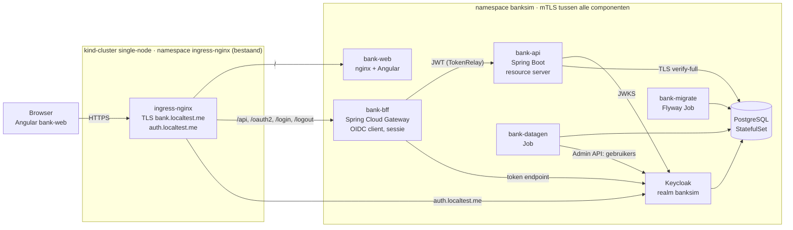
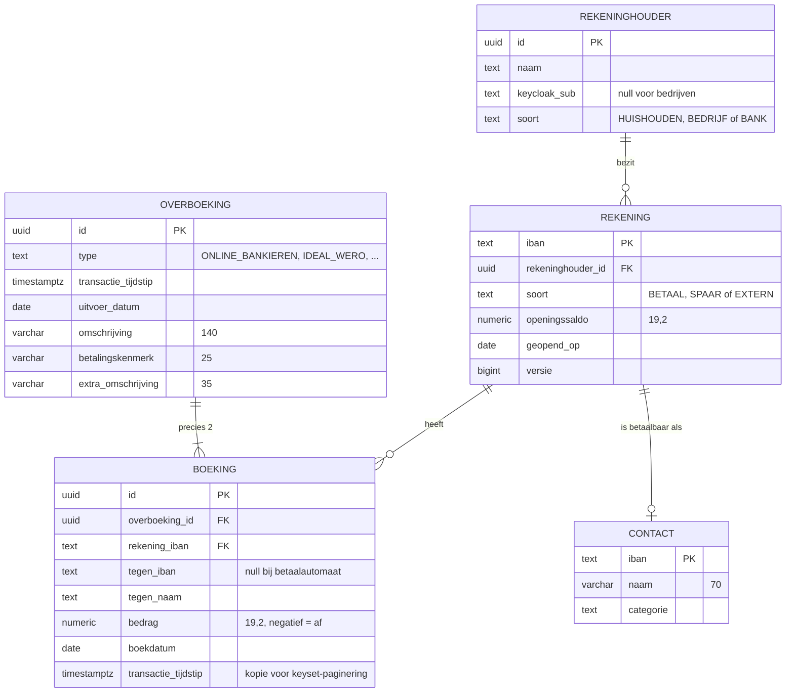
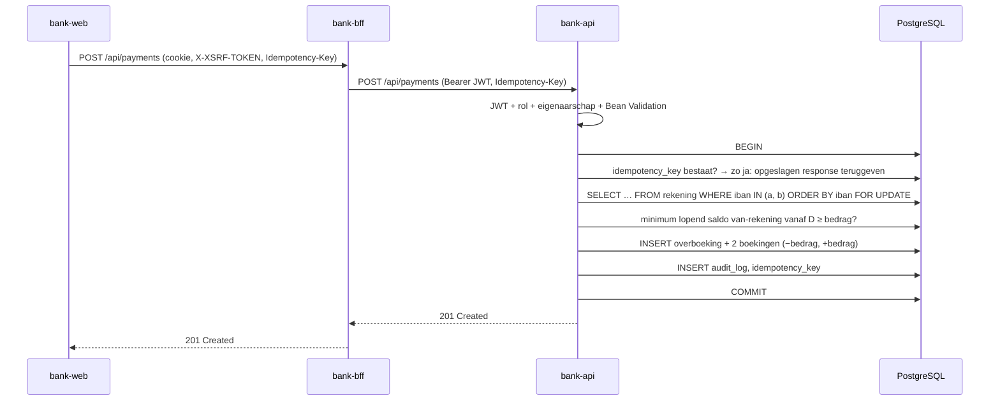
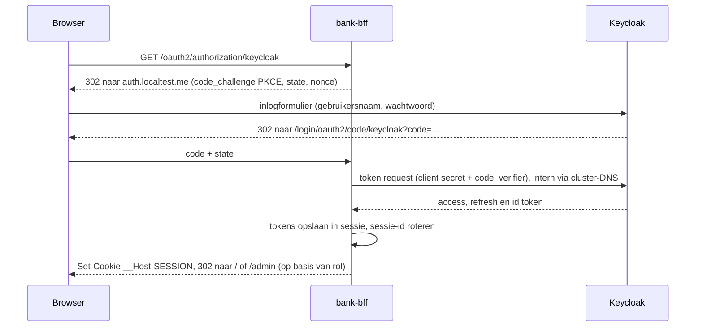

# BankSim – Technisch ontwerp

Dit document beschrijft hoe het [functioneel ontwerp](functioneel-ontwerp.md) (FO) wordt gebouwd: een Java 21 / Spring Boot backend, een Angular/TypeScript frontend, Keycloak voor identiteit en PostgreSQL voor opslag, draaiend in een eigen namespace `banksim` in het bestaande kind-cluster `single-node` (OrbStack). De harde uitgangspunten zijn: atomaire overboekingen, rekenen met `BigDecimal`, zero trust, OWASP Top 10:2025, bestand tegen uitval van netwerk en services, regressietests voor de backend en Playwright e2e-tests voor de frontend.

## 1. Uitgangspunten

### 1.1 Technologie

| Laag | Keuze | Versie |
| --- | --- | --- |
| Taal backend | Java | 21 (LTS) |
| Backend framework | Spring Boot, Spring Security, Spring JDBC (`JdbcClient`), Spring Modulith | 4.0.x (Spring Cloud 2025.1 ondersteunt 4.1 nog niet) |
| BFF / gateway | Spring Cloud Gateway (Server WebMVC) + Spring Security OAuth2 Client | Spring Cloud release-train passend bij Boot 4.x |
| Resilience | Resilience4j (+ `@Retryable`/`@ConcurrencyLimit` uit Spring Framework 7) | Actueel |
| Identiteit | Keycloak (officiële image als Deployment in `banksim`, realm-import bij start) | Actuele stabiele, minimaal 26 |
| Database | PostgreSQL (officiële image als StatefulSet in `banksim`), migraties met Flyway | Minimaal 17 |
| Frontend | Angular (standalone components, signals), TypeScript strict | Actuele stabiele |
| Rekenen in frontend | `big.js` | Actueel |
| E2E-tests | Playwright (TypeScript) | Actueel |
| Backend-tests | JUnit 5, AssertJ, Testcontainers, jqwik, ArchUnit, Toxiproxy, PIT | Actueel |
| Platform | Bestaand kind-cluster `single-node` in OrbStack, bestaande ingress-nginx, Helm-chart + installatiescripts | kind ≥ 0.31, Helm 4 |
| Build | Maven (backend), npm (frontend), Jib (images) | Maven 3.9, Node 22 LTS |

Versies worden niet in dit document vastgepind; de build gebruikt de Spring Boot BOM en een `package-lock.json`, zodat elke build reproduceerbaar is (zie A03 in hoofdstuk 11).

### 1.2 Belangrijkste ontwerpkeuzes

| Keuze | Waarom |
| --- | --- |
| Backend-for-Frontend (BFF) i.p.v. tokens in de browser | Geen access/refresh tokens in JavaScript; sessiecookie is HttpOnly. Aanbevolen patroon voor browser-apps met gevoelige data. |
| Eén grootboek: elke IBAN is een rekening | Elke geldbeweging heeft altijd twee kanten (af + bij) in dezelfde databasetransactie, ook bij betalingen aan bedrijven. |
| Saldo wordt berekend, niet opgeslagen | De simulatiedatum kan heen en weer; saldo = openingssaldo + som boekingen t/m die datum. |
| Bedragen als `BigDecimal` / `NUMERIC(19,2)` / JSON-string | Geen afrondingsfouten in Java, database of browser. |
| Migraties als aparte Job, JWKS lazy | De API start ook als database of Keycloak (nog) niet bereikbaar is en meldt zich dan alleen "niet ready". |
| Alles in één namespace `banksim` van het bestaande cluster | Installeren en verwijderen met één script; geen operators, mesh of andere cluster-brede componenten. Alleen de bestaande ingress-nginx wordt gedeeld. |
| Zero trust met mTLS in de applicaties zelf | Elke service heeft een eigen certificaat van een BankSim-CA en controleert het certificaat van de aanroeper. Geen service mesh nodig, dus niets buiten de namespace. |
| Eén Angular-app met rol-afhankelijke routes | Het FO heeft één inlogscherm; de admin gebruikt de klantschermen in alleen-lezen modus. Eén host houdt het sessiecookie eenvoudig. |

## 2. Architectuur



| Component | Verantwoordelijkheid |
| --- | --- |
| `bank-web` | Angular-app, statisch geserveerd door nginx (unprivileged). Bevat alle schermen uit het FO. Doet zelf geen authenticatie: vraagt `/api/me` aan de BFF. |
| `bank-bff` | OIDC Authorization Code + PKCE met Keycloak als confidential client; bewaart tokens server-side in een gedeelde sessie (Spring Session JDBC in PostgreSQL, schema `bff`; alle sessie-attributen, dus ook access-, refresh- en ID-token, versleuteld met AES-256-GCM via de ConversionService van Spring Session; expliciet `HttpSessionOAuth2AuthorizedClientRepository`, want de Spring Boot-standaard houdt tokens in het geheugen van één pod), zodat elke replica elke request kan afhandelen; zet HttpOnly/Secure/SameSite=Strict-cookie en CSRF-token; stuurt `/api/**` door naar `bank-api` met het access token (`TokenRelay`) en zonder cookies en CSRF-token; rate limiting (Bucket4j, buckets in `bff.bucket`, login vóór en boekingen ná Spring Security; de limiet is de configuratieversie van een bucket, zodat een gewijzigde limiet ook direct voor bestaande buckets geldt); na login redirect naar `/` (klant) of `/admin` (op basis van de realmrollen die een mapper in het ID-token zet; admin). |
| `bank-api` | Alle businesslogica en autorisatie. OAuth2 Resource Server: valideert elk JWT zelf (signatuur, issuer, audience `bank-api`, expiry). |
| Keycloak | Gebruikers, wachtwoorden, rollen `klant` en `admin`, brute-force-detectie, optioneel TOTP. Officiële image als Deployment (1 replica), database `keycloak` in dezelfde PostgreSQL. |
| PostgreSQL | Grootboek, contacten, instellingen, audit log, BFF-sessies en de Keycloak-database. Officiële image als StatefulSet (1 instance) met PVC op storage class `standard`. |
| `bank-migrate` | Flyway-migraties als Kubernetes Job, vóór (her)deploy van de API. |
| `bank-datagen` | Deterministische generator van 5 jaar fake data + Keycloak-gebruikers (hoofdstuk 9). |

### 2.1 Repository-indeling

```text
banksim/
├── doc/                      functioneel- en technisch ontwerp
├── backend/                  Maven multi-module
│   ├── pom.xml               parent, Spring Boot BOM, plugin-versies
│   ├── bank-domain/          Money, Iban, ledger-regels (geen Spring-afhankelijkheden)
│   ├── bank-platform/        gedeelde infrastructuur: mTLS-clientcontrole (CN-allow-list)
│   ├── bank-api/             REST API (Spring Modulith-modules)
│   ├── bank-bff/             Spring Cloud Gateway BFF
│   ├── bank-migrate/         Flyway-migraties + runner
│   └── bank-datagen/         fake data-generator
├── frontend/                 Angular workspace, app bank-web
│   └── src/app/{core,klant,admin,shared,api}   api = gegenereerd uit openapi.yaml
├── e2e/                      Playwright-tests
└── deploy/
    ├── scripts/              install.sh, uninstall.sh, certs.sh, reset-data.sh, trust-ca.sh
    └── banksim/              Helm-chart: apps, Keycloak, PostgreSQL, Ingress, NetworkPolicies
```

## 3. Backend-ontwerp (`bank-api`)

### 3.1 Modules

Package-by-feature; Spring Modulith bewaakt in een test dat modules alleen via hun publieke API met elkaar praten. Databasetoegang gaat via `JdbcClient` met expliciete SQL in plaats van JPA: saldo op een datum, keyset-paginering en de controle op het laagste toekomstige saldo zijn zo direct en controleerbaar. De rentecorrectie hangt via het event `OverboekingGeboekt` aan het grootboek, zodat `ledger` niet van `savings` afhangt.

| Module | Inhoud |
| --- | --- |
| `ledger` | `LedgerService`: de enige plek waar geld wordt geboekt; saldoberekening; locking |
| `account` | Rekeningen, overzicht, saldo op simulatiedatum |
| `transaction` | Transactielijst, zoeken, keyset-paginering, details |
| `payment` | Betalen naar contacten (validatie, idempotency) |
| `savings` | Inleggen/opnemen, rente (`InterestService`) |
| `contact` | Contactenlijst, suggesties |
| `simulation` | `SimulationClock`, simulatiedatum |
| `admin` | Rekeninghouders-overzicht, alleen-lezen inzage |
| `audit` | Audit-events vastleggen |
| `security` | JWT-configuratie, `CurrentUser`, eigenaarschapschecks |

### 3.2 REST API

Alle endpoints onder `/api`, JSON, OpenAPI 3.1-contract (`bank-api/src/main/resources/openapi.yaml`, contract-first). De Angular-client wordt uit dit contract gegenereerd. Bedragen zijn strings (`"1842.17"`), datums ISO-8601.

| Methode + pad | Rol | FO-scherm | Toelichting |
| --- | --- | --- | --- |
| `GET /api/me` | klant, admin | alle | Naam, rollen |
| `GET /api/me/accounts` | klant | Overzicht | Rekeningen met saldo op simulatiedatum |
| `GET /api/accounts/{iban}` | klant (eigenaar), admin | Betaal-/Spaarrekening | Kop: naam, IBAN, saldo; bij spaar ook lopende rente |
| `GET /api/accounts/{iban}/transactions` | klant (eigenaar), admin | Betaal-/Spaarrekening, Zoeken | Query: `cursor`, `size` (max 50), `q`, `min`, `max`, `type`, `direction=ALL\|OUT\|IN` |
| `GET /api/contacts?q=` | klant | Betalen | Max 10 suggesties op naam of IBAN |
| `POST /api/payments` | klant (eigenaar van van-rekening) | Betalen | Header `Idempotency-Key` verplicht |
| `POST /api/transfers` | klant (eigenaar van beide) | Overschrijven | Inleg/opname; `Idempotency-Key` verplicht |
| `GET /api/admin/simulation-date` | admin | Admin | Datum + toegestaan bereik |
| `PUT /api/admin/simulation-date` | admin | Admin | Wordt geaudit |
| `GET /api/admin/holders?q=` | admin | Admin | Overzicht rekeninghouders met saldi |
| `GET /api/admin/holders/{id}/accounts` | admin | Admin → Overzicht | Alleen-lezen |

Transactielijsten gebruiken **keyset-paginering** op `(transactie_tijdstip DESC, id DESC)`. De response bevat `items` en `nextCursor` (opaque, base64url, ondertekend met HMAC zodat de cursor niet te manipuleren is). Datumregels en jaartal-tussenregels maakt de frontend; "Toon meer" vraagt de volgende 50 met `nextCursor`, en verdwijnt als `nextCursor` leeg is.

Fouten volgen RFC 9457 (`ProblemDetail`):

```json
{
  "type": "https://banksim.local/problems/saldo-ontoereikend",
  "title": "Saldo ontoereikend",
  "status": 422,
  "detail": "Deze betaling zou het saldo onder € 0,00 brengen.",
  "correlationId": "7c1e…"
}
```

## 4. Datamodel

Elke IBAN in het systeem is een `rekening` in één grootboek: de betaal- en spaarrekeningen van de 10 huishoudens, maar ook de rekeningen van bedrijven (werkgever, supermarkt, energieleverancier, …) een interne renterekening en een kasrekening van BankSim (tegenrekening voor opnames bij de geldautomaat). Bedrijfsrekeningen hebben geen login, maar wel boekingen. Daardoor heeft elke geldbeweging altijd twee kanten.



Overige tabellen:

| Tabel | Doel |
| --- | --- |
| `idempotency_key` | `sleutel`, `rekeninghouder_id`, `request_hash`, `response_status`, `response_body`, `aangemaakt_op`; primaire sleutel (`sleutel`, `rekeninghouder_id`) |
| `audit_log` | Wie, wat, wanneer, correlation-id; append-only (geen UPDATE/DELETE-rechten voor de applicatie-user) |
| `instelling` | `simulatiedatum`, `data_vanaf`, `data_tot` |

Constraints en indexen:

- `CHECK (bedrag <> 0)` op `boeking`; een deferred constraint-trigger controleert bij commit dat elke overboeking precies 2 boekingen op 2 verschillende rekeningen heeft die samen 0 zijn.
- Index `boeking (rekening_iban, transactie_tijdstip DESC, id DESC)` voor keyset-paginering en `boeking (rekening_iban, boekdatum) INCLUDE (bedrag)` voor het saldo op een datum.
- `pg_trgm` GIN-index op `tegen_naam` en `omschrijving` voor "Naam, bedrag, IBAN of omschrijving".
- Saldo op datum D: `openingssaldo + SUM(bedrag) WHERE rekening_iban = ? AND boekdatum <= D`.
- De applicatie-user heeft alleen DML-rechten; DDL alleen voor de migratie-user.

## 5. Geld en BigDecimal

Alle bedragen zijn `BigDecimal`, overal. `double`, `float` en `Number` worden nergens voor geld gebruikt.

```java
public record Money(BigDecimal amount) implements Comparable<Money> {
    public static final int SCALE = 2;
    public static final RoundingMode ROUNDING = RoundingMode.HALF_EVEN;

    public Money {
        Objects.requireNonNull(amount);
        if (amount.scale() > SCALE) {
            throw new IllegalArgumentException("Max. 2 decimalen");
        }
        amount = amount.setScale(SCALE, ROUNDING);
    }
    public static Money of(String value) { return new Money(new BigDecimal(value)); }
    public Money plus(Money other)  { return new Money(amount.add(other.amount)); }
    public Money minus(Money other) { return new Money(amount.subtract(other.amount)); }
    public Money negate()           { return new Money(amount.negate()); }
    public boolean isNegative()     { return amount.signum() < 0; }
    @Override public int compareTo(Money o) { return amount.compareTo(o.amount); }
}
```

| Plaats | Regel |
| --- | --- |
| Domein | `Money` (scale 2, `HALF_EVEN`); vergelijken met `compareTo`, nooit `equals` op `BigDecimal` |
| Rente | Tussenresultaten op scale 10 met `MathContext.DECIMAL128`; pas bij het boeken afronden naar scale 2 |
| Database | `NUMERIC(19,2)`; via `JdbcClient` direct als `BigDecimal` gelezen en geschreven |
| JSON | Jackson schrijft/leest bedragen als string (`"-63.48"`); invoer met meer dan 2 decimalen → 400 |
| Frontend | Bedragen blijven strings of `Big` (`big.js`); invoer met komma wordt genormaliseerd; weergave als `1.842,17` via een eigen `MoneyPipe` op basis van `Big`, niet via `Number` |
| Bewaking | ArchUnit-regel: geen velden, parameters of returntypes `double`/`float`/`Double`/`Float` in `..domain..`, `..ledger..`, `..payment..`, `..savings..`; ESLint-regel in de frontend die `parseFloat`/`Number()` in `money/` verbiedt |

## 6. Overboekingen en transactionaliteit

Alle geldbewegingen lopen via één methode: `LedgerService.boek(...)`. Dat geldt voor betalingen naar bedrijven, betalingen tussen huishoudens, inleg en opname op de spaarrekening en rente. De generator gebruikt dezelfde domeinregels. Afschrijving en bijschrijving gebeuren altijd in **dezelfde databasetransactie**: er wordt nooit afgeschreven zonder dat de doelrekening is bijgeschreven.



```java
@Transactional(isolation = Isolation.READ_COMMITTED, timeout = 5)
public Overboeking boek(BoekOpdracht opdracht) {
    var rekeningen = rekeningRepository.lockInVasteVolgorde(
            opdracht.van(), opdracht.naar());          // SELECT … ORDER BY iban FOR UPDATE
    var van = rekeningen.get(opdracht.van());
    var naar = rekeningen.get(opdracht.naar());

    if (van.magNietRoodStaan()) {                      // BETAAL en SPAAR; EXTERN niet
        Money minimum = saldoQuery.minimumLopendSaldoVanaf(van.iban(), opdracht.boekdatum());
        if (minimum.minus(opdracht.bedrag()).isNegative()) {
            throw new SaldoOntoereikendException(van.iban());
        }
    }
    var overboeking = Overboeking.nieuw(opdracht);
    boekingRepository.saveAll(List.of(
            Boeking.af(overboeking, van, naar, opdracht.bedrag()),
            Boeking.bij(overboeking, naar, van, opdracht.bedrag())));
    audit.vastleggen(AuditEvent.overboeking(overboeking));
    return overboeking;
}
```

Regels:

- **Locking**: beide rekeningen worden met `SELECT … FOR UPDATE` vergrendeld, altijd in IBAN-volgorde, zodat twee gelijktijdige overboekingen A→B en B→A geen deadlock geven.
- **Nooit rood staan**: de generator heeft al boekingen na de simulatiedatum D gemaakt. Daarom controleert de service niet alleen het saldo op D, maar het **minimum van het lopende saldo vanaf D** (window-functie over boekingen ≥ D). Zo kan een betaling op D er niet voor zorgen dat de rekening later alsnog negatief komt. Bij inleg/opname gebeurt deze controle als laatste stap, ná de rentecorrecties (hoofdstuk 7), want minder rente kan een latere opname onder nul brengen.
- **Spaarrekening**: opnemen kan alleen tot het saldo; inleggen alleen tot het saldo van de betaalrekening. De betaalrekening ziet type `Overschrijving`, de spaarrekening type `Inleg` of `Opname`.
- **Idempotency**: `Idempotency-Key` (UUID, door de frontend per formulierverzending gemaakt) wordt in dezelfde transactie opgeslagen. Een herhaald verzoek met dezelfde key en dezelfde inhoud krijgt de opgeslagen response terug; met andere inhoud volgt 422. Zo zijn retries na een netwerkfout veilig.
- **Database-garantie**: de deferred constraint-trigger (hoofdstuk 4) weigert een commit waarbij een overboeking niet uit precies twee boekingen met som 0 bestaat.
- **Fouten**: elke exception binnen `boek` leidt tot een rollback; er blijft nooit een halve overboeking achter.
- **Tijdstip**: transactie_tijdstip = simulatiedatum D + huidige tijd (Europe/Amsterdam); uitvoer_datum = D.

## 7. Rente

| Regel | Uitwerking |
| --- | --- |
| Percentage | Vast 3% per jaar |
| Berekening | Dagelijks over het eindsaldo van de dag: `saldo × 0,03 / dagen-in-jaar` (365 of 366), scale 10 |
| Bijschrijving | Op de laatste dag van elke maand, afgerond op 2 decimalen (`HALF_EVEN`), als overboeking van de BankSim-renterekening naar de spaarrekening, type `Rente` |
| Lopende rente | Wordt bij `GET /api/accounts/{iban}` on-the-fly berekend van de 1e van de maand t/m D en apart getoond |
| Herberekening | Na elke inleg of opname herberekent `InterestService` in dezelfde transactie de rente van de betreffende maand en alle latere maanden van die spaarrekening. Verschillen worden via `LedgerService` geboekt als correctieboeking (type `Rente`, omschrijving "Rentecorrectie"); bestaande boekingen worden nooit verwijderd of gewijzigd |

## 8. Simulatiedatum

- `SimulationClock` vervangt overal `LocalDate.now()`. Een ArchUnit-regel verbiedt `now()` zonder `Clock` in domeincode.
- De datum staat in `instelling` en wordt met een korte TTL (5 s) gecachet.
- Alle queries filteren op `boekdatum <= D`: transactielijst, zoeken, saldo, admin-overzicht.
- Het bereik is beperkt tot `data_vanaf` (1-10-2021) t/m `data_tot` (31-12-2026). "Terug naar vandaag" zet D op de systeemdatum binnen dat bereik.
- Boekingen worden nooit verwijderd door het verzetten van de datum; ze zijn alleen onzichtbaar na D.

## 9. Fake data-generator (`bank-datagen`)

- Draait als Kubernetes Job (en lokaal als CLI), schrijft via bulk-insert (`COPY`) in één databasetransactie naar PostgreSQL. Na install/upgrade draait hij in modus `ALS_LEEG` (alleen als de database leeg is, zodat een upgrade geen data wist); `reset-data.sh` draait hem in modus `ALTIJD`.
- **Deterministisch**: vaste seed → steeds dezelfde data. Dit is ook de basis voor de e2e-tests.
- Maakt de 10 huishoudens met profielen en het transactiepatroon uit het FO, plus de bedrijven met geldige NL-IBAN's (mod-97-checksum, fictieve bankcode `SIMB`). Alle IBAN's die betaalbaar zijn komen in `contact`.
- Boekt in memory via dezelfde `bank-domain`-regels als `LedgerService`: double-entry, nooit rood (bij een tekort eerst een opname van de spaarrekening of een niet-vaste uitgave overslaan), maandelijkse rente.
- Houdt op elke betaalrekening een buffer van ongeveer een kwart maandinkomen aan. Omdat de data tot eind 2026 doorloopt, telt de regel "nooit rood" ook de al gegenereerde toekomstige boekingen mee; zonder buffer zou een klant vrijwel niets meer kunnen betalen.
- Maakt via de Keycloak Admin API (service-account-client `bank-datagen` met alleen `manage-users`, `view-users` en `view-realm`) 10 klanten en de beheerder aan, idempotent zodat hun Keycloak-id gelijk blijft; wachtwoorden komen uit een Kubernetes Secret dat bij installatie wordt gegenereerd, niet uit Git.
- Controleert aan het eind in de database de invarianten (som van alle boekingen = 0, geen dag met een negatief betaal- of spaarsaldo). Een golden-master-test legt een checksum van de eindsaldi en het aantal overboekingen vast (seed 42: ruim 30.000 overboekingen).
- Rekent net als het domein nooit met floating point: bedragen worden in centen getrokken (ArchUnit-regel).

## 10. Security en zero trust

Uitgangspunt: geen enkele verbinding wordt vertrouwd omdat hij "van binnen" komt. Elke stap authenticeert en autoriseert opnieuw.

### 10.1 Lagen

| Laag | Maatregel |
| --- | --- |
| Browser → ingress | Alleen HTTPS via de bestaande ingress-nginx, met een certificaat voor `bank.localtest.me` en `auth.localtest.me` van de BankSim-CA; HSTS; HTTP wordt alleen omgeleid |
| Ingress → banksim | ingress-nginx praat HTTPS met web, bff en Keycloak, verifieert hun certificaat (`proxy-ssl-verify`) en toont zelf een clientcertificaat (`proxy-ssl-secret`) |
| Browser → BFF | Sessiecookie `__Host-SESSION` (HttpOnly, Secure, SameSite=Strict, Path=/); CSRF via `XSRF-TOKEN`-cookie + `X-XSRF-TOKEN`-header (Angular `HttpClient` ondersteunt dit standaard) of `_csrf`-parameter (uitlogformulier), beide met het ruwe token: het cookie wordt bij elk antwoord gezet en het token komt nooit in HTML, dus maskeren tegen BREACH is niet nodig; sessie-timeout 15 min inactief, max 8 uur |
| BFF → API | Access token (JWT, 5 min geldig) via `TokenRelay`; API valideert signatuur, `iss`, `aud=bank-api`, `exp`, `nbf` |
| Pod ↔ pod | mTLS in de applicaties: elke component heeft een eigen certificaat van de BankSim-CA (CN = componentnaam, SAN = service-DNS) en eist een clientcertificaat van die CA. Daarnaast controleert de ontvanger de CN van de aanroeper tegen een allow-list: web en bff accepteren alleen `ingress`, api alleen `bank-bff`, PostgreSQL koppelt de CN aan de databasegebruiker. Toegestane paden: ingress→web, ingress→bff, ingress→keycloak, bff→api, bff→keycloak, bff→postgres (sessies), api→keycloak, api→postgres, keycloak→postgres, migrate/datagen→postgres, datagen→keycloak |
| Netwerk | Kubernetes `NetworkPolicy` default-deny (ingress en egress) in namespace `banksim`, met allow-regels voor precies de paden hierboven; inkomend verkeer van buiten de namespace alleen vanuit namespace `ingress-nginx`; DNS naar `kube-system`; kubelet-probes vanaf het node-IP op de aparte health-poorten |
| → PostgreSQL | TLS `sslmode=verify-full` en authenticatie met clientcertificaat (`pg_hba`: `hostssl … cert clientcert=verify-full`), geen wachtwoorden; aparte DB-users per component: `bank_app` (DML), `bank_bff` (alleen schema `bff`), `bank_migrate` (DDL), `bank_datagen`, `keycloak` (eigen database) |
| Health-poorten | Probes gaan naar aparte poorten zonder clientcertificaat (Spring Actuator op 8081, Keycloak-management op 9000, nginx `/healthz` op 8081); die poorten staan via NetworkPolicy alleen open voor het node-IP en zitten niet in de Ingress |
| Certificaten | `certs.sh` maakt bij installatie een BankSim-CA en per component een certificaat (geldig 90 dagen) als Secret in `banksim`; `public` is het servercertificaat voor de publieke hosts op ingress-nginx, `ingress` het clientcertificaat waarmee ingress-nginx zich bij de backends meldt; Java-componenten krijgen ze als PEM via Spring SSL bundles; `install.sh --rotate-certs` vernieuwt ze. De CA-sleutel blijft alleen lokaal in `deploy/.secrets/` (in `.gitignore`) |
| Secrets | Kubernetes Secrets, gegenereerd bij installatie; nooit in Git, images of logs |

### 10.2 Inloggen



Keycloak gebruikt `KC_HOSTNAME=https://auth.localtest.me` met dynamisch backchannel. `auth.localtest.me` wijst binnen een pod naar 127.0.0.1, dus BFF en API gebruiken die host alleen voor de browser-redirect en praten verder via cluster-DNS met Keycloak. Daarom configureert de BFF de provider expliciet in plaats van met `issuer-uri` (geen discovery bij startup):

```yaml
spring.security.oauth2.client.provider.keycloak:
  authorization-uri: https://auth.localtest.me/realms/banksim/protocol/openid-connect/auth
  token-uri:         https://keycloak.banksim.svc:8443/realms/banksim/protocol/openid-connect/token
  jwk-set-uri:       https://keycloak.banksim.svc:8443/realms/banksim/protocol/openid-connect/certs
  user-info-uri:     https://keycloak.banksim.svc:8443/realms/banksim/protocol/openid-connect/userinfo
  user-name-attribute: preferred_username
```

BFF en API valideren de issuer tegen de publieke URL `https://auth.localtest.me/realms/banksim`, zodat die overal gelijk is. Een audience-mapper in de client scope zet `bank-api` in `aud`.

### 10.3 Autorisatie in de API

- `@PreAuthorize("hasRole('klant')")` / `hasRole('admin')` op elke controller-methode; ontbreekt een annotatie, dan faalt een ArchUnit-test (deny by default).
- **Eigenaarschap**: voor de rol `klant` krijgt elke rekening-query de `keycloak_sub` van de ingelogde gebruiker mee (`WHERE r.iban = :iban AND h.keycloak_sub = :sub`). Een onbekende of andermans IBAN geeft 404, geen 403, zodat het bestaan niet uitlekt.
- **Uitzondering admin**: de admin mag rekeningen van alle huishoudens lezen (`h.soort = 'HUISHOUDEN'`), maar niet de grootboekrekeningen van bedrijven en BankSim. Deze uitzondering zit in één aparte query-methode met eigen tests.
- **Admin is alleen-lezen**: admin-endpoints zijn GET, behalve `PUT /simulation-date`. `POST /payments` en `/transfers` vereisen rol `klant` en eigenaarschap; de admin kan dus nooit namens een klant betalen.
- Betalen kan alleen naar een IBAN in `contact`, en de naam moet bij dat contact passen. Dit wordt server-side gecontroleerd, niet alleen in de UI.

### 10.4 Frontend-hardening

- Content-Security-Policy via nginx: `default-src 'self'; script-src 'self'; style-src 'self' 'nonce-…'; img-src 'self' data:; font-src 'self'; connect-src 'self'; object-src 'none'; frame-ancestors 'none'; base-uri 'self'; form-action 'self' https://auth.localtest.me`. nginx vervangt per request een placeholder in `index.html` door een nonce (`$request_id`); Angular zet die via `ngCspNonce` op zijn `<style>`-elementen. Inline critical CSS staat uit, omdat die een `onload`-handler gebruikt. `base-uri` is `'self'` vanwege Angulars `<base href="/">`.
- Overige headers: `X-Content-Type-Options: nosniff`, `Referrer-Policy: no-referrer`, `Permissions-Policy` restrictief.
- Geen `innerHTML`/`bypassSecurityTrust*`; Angular escapet standaard. ESLint-regels bewaken dit.

## 11. OWASP Top 10:2025

| Categorie | Maatregelen in BankSim |
| --- | --- |
| **A01 Broken Access Control** | Deny-by-default (`@PreAuthorize` verplicht, ArchUnit-test); eigenaarschapscheck in elke query (IDOR); admin alleen-lezen; HMAC-ondertekende cursors; CORS uit (alles via één origin); e2e- en integratietests op toegang tot andermans IBAN en admin-URL's als klant |
| **A02 Security Misconfiguration** | Actuator alleen `health` op aparte management-poort, niet via de ingress; geen standaardwachtwoorden (Secrets gegenereerd); security headers; containers non-root, `readOnlyRootFilesystem`, `drop: [ALL]`, `seccompProfile: RuntimeDefault`; foutmeldingen zonder stacktraces; Keycloak-admin-console en `/admin` niet via de ingress bereikbaar (alleen `/realms/banksim` en `/resources`) |
| **A03 Software Supply Chain Failures** | Versies via Spring Boot BOM en `package-lock.json` (`npm ci`); OWASP Dependency-Check en `npm audit` in CI met drempel; CycloneDX-SBOM voor backend, frontend en images; Trivy-scan van images; base-images op digest gepind; Renovate voor updates; alleen Maven Central en npmjs |
| **A04 Cryptographic Failures** | TLS overal (ingress, mTLS tussen alle componenten, PostgreSQL verify-full met certificaat-authenticatie); geen eigen crypto; wachtwoord-hashing door Keycloak (Argon2/PBKDF2); JWT RS256/ES256 met sleutelrotatie in Keycloak; geen gevoelige data in URL's of logs |
| **A05 Injection** | Alleen geparametriseerde queries (`JdbcClient`; zoeken bouwt de SQL uit vaste fragmenten, waarden altijd als parameter, `ILIKE` met ge-escapete jokertekens); Bean Validation op alle invoer (lengtes uit het FO: 70/34/140/25/35); IBAN-checksum; Angular-templates escapen; geen dynamische HTML |
| **A06 Insecure Design** | Threat model (STRIDE) per flow; businessregels alleen server-side (nooit rood, alleen contacten, bedragen > 0); idempotency; transactielimieten en rate limiting (Bucket4j in de BFF met PostgreSQL-backend, dus gedeeld over replicas: login, betalen); double-entry met databaseconstraint als laatste verdedigingslinie |
| **A07 Authentication Failures** | Keycloak: brute-force-detectie, wachtwoordbeleid, optioneel TOTP-MFA; sessie-id rotatie na login; korte access tokens (5 min) met refresh-token-rotatie; uitloggen trekt ook de Keycloak-sessie in (RP-initiated logout) |
| **A08 Software or Data Integrity Failures** | JWT-signatuur altijd gevalideerd (geen `alg=none`); geen Java-deserialisatie van onbetrouwbare data; Flyway-checksums; audit log append-only; images bouwen met Jib (reproduceerbaar) en optioneel ondertekenen met cosign |
| **A09 Security Logging and Alerting Failures** | `audit_log` voor login-gerelateerde events (via Keycloak-events), betalingen, overschrijvingen, wijziging simulatiedatum en geweigerde toegang; gestructureerde JSON-logs met correlation-id, zonder tokens, wachtwoorden of volledige IBAN's (gemaskeerd); Micrometer-metrics op mislukte logins en 403/404-pieken met een alert-regel |
| **A10 Mishandling of Exceptional Conditions** | Centrale `@RestControllerAdvice` → `ProblemDetail`, nooit interne details; fail-closed (bij twijfel weigeren, bv. JWKS onbekend → 401); transacties rollen volledig terug; timeouts op alle uitgaande calls; geen lege `catch`-blokken (Error Prone / Sonar-regel); tests voor foutpaden (DB weg, Keycloak weg) |

## 12. Resilience

De backend moet blijven werken, of netjes en veilig falen, als het netwerk, de database of Keycloak niet beschikbaar is.

### 12.1 Opstarten zonder afhankelijkheden

- Migraties draaien in de Job `bank-migrate`, niet bij het opstarten van de API.
- API en BFF gebruiken expliciete endpoints (`jwk-set-uri`, `token-uri`, …) in plaats van `issuer-uri`, dus geen discovery bij startup (hoofdstuk 10.2).
- De BFF-sessiestore (PostgreSQL) wordt pas bij het eerste verzoek benaderd; zonder database werkt inloggen tijdelijk niet, maar de pod start wel.
- Geen databasecalls in `@PostConstruct` of `ApplicationRunner`.
- Gevolg: de pod start altijd. De **startupProbe** wacht tot de JWKS één keer is opgehaald en de database één keer bereikbaar was; daarna is de pod ready. **Liveness** is alleen "proces leeft".
- Een latere storing van database of Keycloak maakt pods bewust **niet** unready: dan zou Kubernetes alle pods tegelijk uit de service halen en krijgt de gebruiker een generieke 503 van de gateway in plaats van de ontworpen foutmelding. De pods blijven bereikbaar en geven zelf een nette `ProblemDetail` terug (zie tabel).

### 12.2 Tijdens gebruik

| Afhankelijkheid | Maatregel | Gedrag bij uitval |
| --- | --- | --- |
| PostgreSQL | HikariCP `connectionTimeout` 3 s, `validationTimeout` 1 s; `statement_timeout` 5 s; transactie-timeout 5 s; pool als bulkhead | 503 `ProblemDetail` met `Retry-After`; geen halve boekingen (rollback); pod blijft ready |
| Keycloak (JWKS) | Sleutels gecachet door de Nimbus-decoder (5 min); ophalen met timeout 2 s; bij onbekende `kid` één keer verversen | Bestaande tokens blijven valideerbaar; onbekende sleutel → 401 (fail closed) |
| Keycloak (BFF: login/refresh) | Timeout 3 s; mislukte token-refresh wordt 401 (opnieuw inloggen) of 503 (Keycloak onbereikbaar) | Nieuwe logins tijdelijk niet mogelijk ("Inloggen is tijdelijk niet mogelijk"); bestaande sessies werken tot het token verloopt |
| BFF → API | Resilience4j via het CircuitBreaker-filter van de gateway (open bij 50% fouten over 20 calls, 10 s open) met fallback naar een 503-ProblemDetail; read-timeout 5 s; retry (max 2, backoff 100–500 ms) **alleen voor GET**; HTTP/1.1 | Frontend toont foutmelding met "Opnieuw proberen"; de route-guards laten de pagina bij een storing gewoon laden (alleen "niet ingelogd" stuurt naar de login), zodat die melding ook bij een directe link verschijnt |
| POST betalen/overschrijven | Geen automatische retry in de BFF; de frontend mag opnieuw proberen met dezelfde `Idempotency-Key` | Nooit dubbel geboekt |

Overig:

- Virtual threads (`spring.threads.virtual.enabled=true`); de connection pool begrenst de belasting van de database.
- Graceful shutdown (`server.shutdown=graceful`, 20 s) en een `preStop`-pauze, zodat lopende transacties afronden.
- Minimaal 2 replicas voor `bank-api` en `bank-bff`, `PodDisruptionBudget` `minAvailable: 1` (zodat bij een rolling update altijd één pod bereikbaar blijft).
- De frontend gebruikt een `HttpInterceptor` die 503 en netwerkfouten vertaalt naar een duidelijke melding en een retry-knop; formulieren behouden hun invoer.

## 13. Teststrategie backend (regressie)

Doel: elke toekomstige wijziging die bestaand gedrag breekt, faalt in de build.

| Niveau | Tooling | Wat wordt getest |
| --- | --- | --- |
| Unit | JUnit 5, AssertJ | `Money`, IBAN-validatie, renteberekening, validatieregels, mapping |
| Property-based | jqwik | Geld: `a + b − b = a`, nooit meer dan 2 decimalen; ledger: som van alle saldi blijft gelijk na willekeurige reeksen overboekingen; nooit negatief saldo; rente is monotoon in saldo |
| Slice | MockMvc + `jwt()` tegen een echte PostgreSQL (de applicatie verbindt als `bank_app`) | Elke endpoint: 401 zonder token, 403 met verkeerde rol, 404 op andermans IBAN, validatiefouten 400/422; repository-queries (keyset, zoeken, saldo op datum) |
| Integratie | Testcontainers (PostgreSQL, Keycloak), `@SpringBootTest` | Volledige flows: betalen, inleggen/opnemen, admin-simulatiedatum; echte JWT's van Keycloak; Flyway-migraties op een lege en een gevulde DB |
| Concurrency | Testcontainers + `ExecutorService` | 100 gelijktijdige overboekingen kriskras tussen rekeningen: geen deadlocks, geen negatief saldo, totaal ongewijzigd |
| Idempotency | Integratie | Dezelfde `Idempotency-Key` 2× → 1 boeking; andere inhoud → 422 |
| Resilience | Toxiproxy (Testcontainers) | DB-verbinding wegvallen midden in een overboeking → rollback, 503 `ProblemDetail`; latency → timeout; Keycloak weg → bestaande tokens werken; API en BFF starten zonder DB/Keycloak en worden ready zodra die er zijn |
| Architectuur | Spring Modulith `verify()`, ArchUnit | Modulegrenzen; geen `double`/`float` in geld-code; `@PreAuthorize` op elke endpoint; geen `LocalDate.now()` zonder `SimulationClock`; alleen `LedgerService` schrijft boekingen |
| Contract | OpenAPI-diff (openapi-diff-maven-plugin) | Breaking changes in de API laten de build falen |
| Golden master | Generator met vaste seed | Checksum van eindsaldi en aantal transacties per rekening ongewijzigd |
| Kwaliteit | JaCoCo (≥ 85% line, ≥ 80% branch op `bank-domain`/`ledger`), PIT mutation testing (≥ 75% op `bank-domain`) | Tests vangen echt gedrag af |

Voorbeeld concurrency-test:

```java
@Test
void gelijktijdigeOverboekingenHoudenTotaalGelijkEnNooitRood() throws Exception {
    Money totaalVoor = saldoQuery.totaalVanAlleRekeningen(vandaag);
    try (var executor = Executors.newVirtualThreadPerTaskExecutor()) {
        var taken = IntStream.range(0, 100)
                .mapToObj(i -> (Callable<Object>) () -> probeer(() -> ledger.boek(willekeurigeOpdracht(i))))
                .toList();
        executor.invokeAll(taken);
    }
    assertThat(saldoQuery.totaalVanAlleRekeningen(vandaag)).isEqualByComparingTo(totaalVoor);
    assertThat(saldoQuery.laagsteSaldoHuishoudens()).isGreaterThanOrEqualTo(Money.of("0.00"));
}
```

Alle tests draaien in `mvn verify`; Testcontainers gebruikt de lokale Docker.

## 14. Playwright e2e-tests

- Map `e2e/`, TypeScript. Page objects in `e2e/pages/`: `LoginPagina` (Keycloak), `OverzichtPagina`, `RekeningPagina` (betaal- en spaarrekening: kop, datum- en jaarregels, uitklappen, Toon meer, zoeken), `BetalenPagina` en `AdminPagina`. Specs per onderwerp in `e2e/tests/`.
- Een setup-project logt via het echte Keycloak-inlogscherm in als klant (`jdevries`) en beheerder en bewaart beide sessies (`e2e/.auth/`, niet in git). De projects `chromium`, `firefox` en `webkit` hangen daarvan af en kiezen per spec de klant- of beheerderssessie. Tests die zelf inloggen (verkeerd wachtwoord, uitloggen, tweede huishouden) gebruiken een verse context; het foute-wachtwoordscenario gebruikt `ljansen`, zodat brute-force-detectie de hoofdgebruiker niet blokkeert.
- Draait tegen de deployment in kind (`baseURL` uit `BANKSIM_URL`, standaard `https://bank.localtest.me`; de lokale CA wordt genegeerd tenzij `BANKSIM_VERTROUW_CA=true`). `globalSetup` haalt de wachtwoorden uit het Secret `banksim-keycloak` en zet de testdata terug met `deploy/scripts/reset-data.sh --simulatiedatum 2026-10-05` (datagen-Job opnieuw met vaste seed, simulatiedatum via `psql` in `postgres-0`); `BANKSIM_E2E_GEEN_RESET=true` slaat dat over. Er bestaan geen test-only endpoints in de applicatie.
- Installeer voor de suite met `deploy/scripts/install.sh --e2e`: dat verhoogt de login-limiet van de BFF naar 200 per minuut, want de suite logt vaker in dan de standaardlimiet van 10 toestaat. Tests delen data en draaien daarom na elkaar (1 worker); betalingen gebruiken per browser een eigen bedrag en beweringen zijn relatief (saldo vóór min bedrag).
- Selectors via `getByRole`/`getByLabel` (dwingt toegankelijke markup af), klassen alleen voor de transactielijst.
- Bij falen: trace, screenshot en video als artefact (`e2e/test-results/`, HTML-rapport in `e2e/playwright-report/`).
- De storingstest schaalt `bank-api` in het cluster naar 0 en weer naar 2 en draait alleen in Chromium.

| Scenario | Controle |
| --- | --- |
| Inloggen klant | Komt op Overzicht met betaal- en spaarrekening en saldi |
| Inloggen admin | Komt op Admin scherm |
| Verkeerd wachtwoord | Foutmelding van Keycloak; blijft op het inlogscherm (blokkeren na N pogingen regelt Keycloak brute-force-detectie) |
| Betaalrekening | Kop toont naam, IBAN, saldo; datumregels; bedragen met teken |
| Toon meer | Eerst 50 regels, daarna 100; knop verdwijnt aan het eind |
| Uitklappen | Details: naam, transactietype, Van/Naar met IBAN, "3 oktober 2026 om 13:26", uitgevoerd op; Betaalautomaat zonder Naar-IBAN |
| Zoeken | Knop wordt "Verberg zoeken"; filter op tekst, bedrag van/t/m, type, in/uit; Wissen zet alles terug; ongeldig bereik geeft melding |
| Betalen | Suggesties uit contacten; max-lengtes 70/34/140/25/35; onbekend IBAN geweigerd; controlescherm + bevestigen; transactie bovenaan; saldo verlaagd |
| Rood staan | Bedrag hoger dan saldo wordt geweigerd |
| Betalen tussen huishoudens | Ontvanger (tweede klant) ziet de bijschrijving |
| Spaarrekening | Jaartal-tussenregel; details met Datum, Tegenrekening, Type; lopende rente zichtbaar |
| Inleggen/Opnemen | Overschrijven-scherm met juiste Van/Naar; beide saldi kloppen na afloop |
| Simulatiedatum | Admin zet datum terug → klant ziet geen latere transacties en saldo van die dag; vooruit → weer zichtbaar |
| Admin alleen-lezen | Admin ziet transacties van een klant; Betalen/Opnemen/Inleggen niet zichtbaar |
| Toegangscontrole | Klant op `/admin` → terug naar Overzicht, admin-API 403; klant opent andermans IBAN-URL → "Rekening is niet gevonden.", API 404; POST zonder CSRF-token → 403 |
| Resilience | API geschaald naar 0 → nette foutmelding en "Opnieuw proberen"; na herstel werkt het weer |
| Uitloggen | Naar Keycloak; opnieuw naar de bank → inlogscherm; `/api/me` → 401 |

## 15. Deployment op kind

### 15.1 Cluster

BankSim komt in een eigen namespace `banksim` in het **bestaande** kind-cluster `single-node` (context `kind-single-node`), dat in OrbStack draait. Er wordt geen nieuw cluster gemaakt en niets buiten de namespace geïnstalleerd.

| Bestaand in het cluster | Gebruik door BankSim |
| --- | --- |
| ingress-nginx (namespace `ingress-nginx`, hostPort 80/443) | Ingang voor `bank.localtest.me` en `auth.localtest.me` via gewone `Ingress`-resources |
| Storage class `standard` (local-path, `Delete`) | PVC van PostgreSQL; bij verwijderen van de namespace verdwijnt de data mee |
| kindnet | Dwingt de `NetworkPolicy`'s af |

`*.localtest.me` verwijst naar 127.0.0.1, dus geen `/etc/hosts`-aanpassing nodig. De node krijgt van OrbStack 10 CPU's en ongeveer 12 GB geheugen; BankSim vraagt in totaal ongeveer 3 GB (Keycloak 1 GB, PostgreSQL 512 MB, api en bff elk 2 × 512 MB, web 2 × 32 MB).

Aandachtspunt: de bestaande ingress-nginx is versie 1.11.3; het ingress-nginx-project is in 2026 gestopt met onderhoud. Voor deze lokale simulatie is dat acceptabel; een overstap naar een Gateway API-implementatie is een latere, cluster-brede keuze.

### 15.2 Installeren en verwijderen

Alles gaat via scripts in `deploy/scripts/`. Ze controleren eerst dat de kubectl-context `kind-single-node` is (te overschrijven met `--context`), zodat nooit per ongeluk een ander cluster wordt geraakt.

| Script | Wat het doet |
| --- | --- |
| `install.sh` | Idempotent. Controleert vereisten (kubectl, helm, docker, openssl, ingress-nginx aanwezig); bouwt de images (overslaan met `--skip-build`) en laadt ze met `kind load docker-image --name single-node`; maakt via `certs.sh` de CA en certificaten als ze nog niet bestaan; maakt Secrets met willekeurige wachtwoorden en sleutels; draait `helm upgrade --install banksim deploy/banksim -n banksim --create-namespace --wait`; toont de URL's en hoe je de testwachtwoorden ophaalt |
| `uninstall.sh` | Vraagt bevestiging (overslaan met `-y`); `helm uninstall banksim` en verwijdert de namespace `banksim` met alle Secrets en de PVC (en dus de data). Met `--purge` ook de BankSim-images van de node en de lokale CA-bestanden. Raakt niets buiten de namespace |
| `certs.sh` | Maakt de BankSim-CA en de certificaten per component (zie 10.1); `--rotate` vernieuwt ze |
| `reset-data.sh` | Draait de `bank-datagen` Job opnieuw (vaste seed) en zet de simulatiedatum terug; gebruikt door de e2e-tests |
| `trust-ca.sh` | Optioneel: zet de BankSim-CA in de macOS-sleutelhanger zodat de browser `https://bank.localtest.me` vertrouwt; `--remove` haalt hem weer weg (`uninstall.sh --purge` doet dat ook) |

De Helm-chart installeert in deze volgorde (via Helm-hooks en `--wait`):

1. Secrets en ConfigMaps (certificaten, realm-configuratie, nginx-config)
2. PostgreSQL StatefulSet met init-script voor databases `bank` en `keycloak` en de gebruikers per component
3. Job `bank-migrate` (Flyway; wacht met retries tot PostgreSQL bereikbaar is)
4. Keycloak Deployment (`start --import-realm`, realm `banksim` met clients `bank-bff` en `bank-datagen`; client secrets via omgevingsvariabelen uit Secrets)
5. Job `bank-datagen` (data + Keycloak-gebruikers)
6. `bank-api`, `bank-bff`, `bank-web`, `Ingress`-resources, `NetworkPolicy`'s, `PodDisruptionBudget`'s

Na installatie controleert `install.sh` met een rooktest dat een tijdelijke pod zonder toestemming `bank-api` niet kan bereiken, en dat `https://bank.localtest.me` antwoordt.

De Ingress gebruikt de annotaties `nginx.ingress.kubernetes.io/backend-protocol: HTTPS`, `proxy-ssl-secret: banksim/tls-ingress-client`, `proxy-ssl-verify: "on"` en `proxy-ssl-name` per service, zodat ook het stuk tussen ingress-nginx en BankSim versleuteld en wederzijds geauthenticeerd is.

### 15.3 Images en pods

- Backend-images met Jib (distroless Java 21 op Debian 13, non-root, base image op digest), frontend-image op `nginx-unprivileged`; tag = git-commit; laden met `kind load docker-image --name single-node`; `imagePullPolicy: IfNotPresent`.
- Elke pod: `runAsNonRoot`, `readOnlyRootFilesystem`, `allowPrivilegeEscalation: false`, `capabilities.drop: [ALL]`, `seccompProfile: RuntimeDefault`, `automountServiceAccountToken: false` (behalve waar nodig), eigen service-account per component.
- Resources: requests/limits per pod; probes: `startupProbe` op een health group `startup` (DB één keer bereikt, JWKS één keer geladen), `livenessProbe` op `/actuator/health/liveness`, `readinessProbe` op `/actuator/health/readiness` (zonder externe afhankelijkheden) (management-poort 8081, niet via de ingress).
- Configuratie via ConfigMaps; geheimen (DB-wachtwoorden, client secret, HMAC-sleutel cursors, Keycloak-wachtwoorden) via Secrets.
- `revisionHistoryLimit: 3`: elke build met een nieuwe image-tag maakt een nieuwe ReplicaSet; zo blijven er per Deployment hooguit drie oude staan.
- Keycloak draait met `KC_CACHE=local`: met één replica is een Infinispan-cluster overbodig, en bij een rolling update zou de nieuwe pod anders wachten op een cluster met de oude pod, wat de NetworkPolicy tegenhoudt.

## 16. Build en CI

Lokaal één `Makefile` als ingang (`make help`): `build`, `test`, `e2e`, `install`, `uninstall`, en voor de supply chain `check`, `audit`, `sbom`, `dependency-check` en `scan`. CI draait in GitHub Actions (`.github/workflows/ci.yml`) bij elke push naar `main`, elke pull request en wekelijks (nieuwe CVE's zonder codewijziging):

| Job | Wat | Faalt bij |
| --- | --- | --- |
| `backend` | `mvnw verify`: unit, slice, integratie (Testcontainers), architectuur, JaCoCo, PIT op `bank-domain`; CycloneDX-SBOM `backend/target/bom.json` | Falende test, drempel niet gehaald |
| `frontend` | `npm ci`, lint, Vitest, productie-build; `scripts/check-api-client.sh` (gegenereerde Angular-client past bij `openapi.yaml`); `npm audit` van frontend en e2e; CycloneDX-SBOM | Falende test, verouderde client, kwetsbaarheid ≥ high |
| `contract` | `scripts/check-contract.sh`: openapi-diff van `openapi.yaml` tegen de basis van de pull request (of de vorige commit) | Achterwaarts incompatibele wijziging (verwijderd endpoint, nieuw verplicht veld, …) |
| `dependency-check` | OWASP Dependency-Check (`-Psecurity`) op de backend; NVD-database in de cache; heeft secret `NVD_API_KEY` nodig, anders overgeslagen met een waarschuwing | CVSS ≥ 7 |
| `e2e` | Tijdelijk kind-cluster `banksim-ci` (`.github/kind-ci.yaml`, poort 80/443) met ingress-nginx 1.11.3 (zelfde versie als `single-node`); `install.sh --context kind-banksim-ci --e2e` incl. rooktests; `scripts/scan-images.sh` (Trivy + SBOM per image); Playwright in Chromium, Firefox en WebKit | Falende installatie of rooktest, HIGH/CRITICAL met beschikbare fix, falende e2e-test |

Artefacten: testrapporten (Surefire, JaCoCo, PIT), SBOM's (backend, frontend, per image), Dependency-Check-rapport, Playwright-rapport met traces, screenshots en video's.

Supply-chainmaatregelen (OWASP A03 Software Supply Chain Failures):

- **Vastgepinde versies.** Alle base images en externe images (distroless Java 21 op Debian 13, node, nginx-unprivileged, Keycloak, PostgreSQL, curl voor de rooktests, Trivy) staan op `tag@sha256:digest`; GitHub Actions staan op commit-SHA; npm via `package-lock.json` en `npm ci`; Maven-plugins met vaste versies.
- **Renovate** (`renovate.json`) werkt dependencies, digests en Actions wekelijks bij; beveiligingsmeldingen direct. Spring Boot blijft op 4.0.x zolang Spring Cloud 4.1 niet ondersteunt. Een eigen regex-manager vindt de images in `values.yaml`, `pom.xml`, scripts en Testcontainers-tests.
- **Trivy** scant de vijf BankSim-images plus Keycloak en PostgreSQL op HIGH/CRITICAL met beschikbare fix. Uitzondering met verantwoording: `gosu` in het PostgreSQL-image wordt overgeslagen, omdat de StatefulSet direct als uid 70 start en gosu nooit draait.
- **Versie-overrides.** Waar een fix nog niet in de Spring Boot-BOM zit, overschrijft `backend/pom.xml` de versie (nu Tomcat 11.0.26 en Jackson 3.1.7 / 2.21.7), met de CVE's in het commentaar; weghalen zodra Spring Boot ze meebrengt. In de frontend zet `overrides` een gepatchte `basic-ftp` en `shell-quote` (GHSA-pqg4-j6r4-53mv, via `concurrently`) onder de OpenAPI-generator (alleen ontwikkeltool); weghalen zodra de generator ze zelf meebrengt.
- **Onderdrukkingen** voor Dependency-Check staan in `backend/dependency-check-suppressions.xml`, elk met reden en einddatum.
- Twee onderdelen vragen een eenmalige stap in GitHub: het secret `NVD_API_KEY` voor Dependency-Check en de Renovate GitHub App. Waarom en hoe staat in de README, paragraaf "Eenmalige inrichting op GitHub".
- Ondertekenen van images (cosign) is optioneel en nu niet ingericht: de images verlaten de lokale machine of CI-runner niet.

## 17. Genomen beslissingen

| Onderwerp | Beslissing |
| --- | --- |
| Cluster | Namespace `banksim` in het bestaande kind-cluster `single-node` (OrbStack); installeren en verwijderen met scripts |
| Zero trust tussen services | mTLS in de applicaties met een eigen BankSim-CA; geen service mesh |
| Keycloak en PostgreSQL | Officiële images in dezelfde namespace, zonder operators |
| Manifests | Helm-chart `deploy/banksim` |
| MFA | TOTP instelbaar in de realm, standaard uit |
| Transactielimiet | Geen limiet naast "nooit rood"; wel rate limiting (hoofdstuk 10) |
