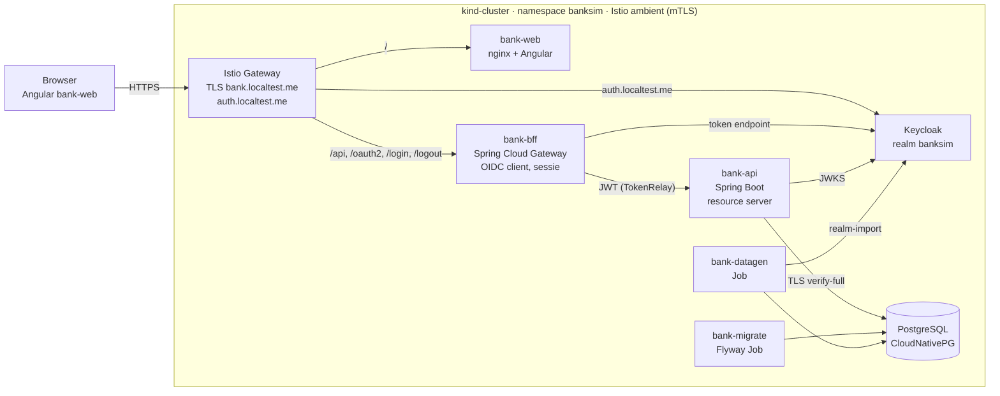
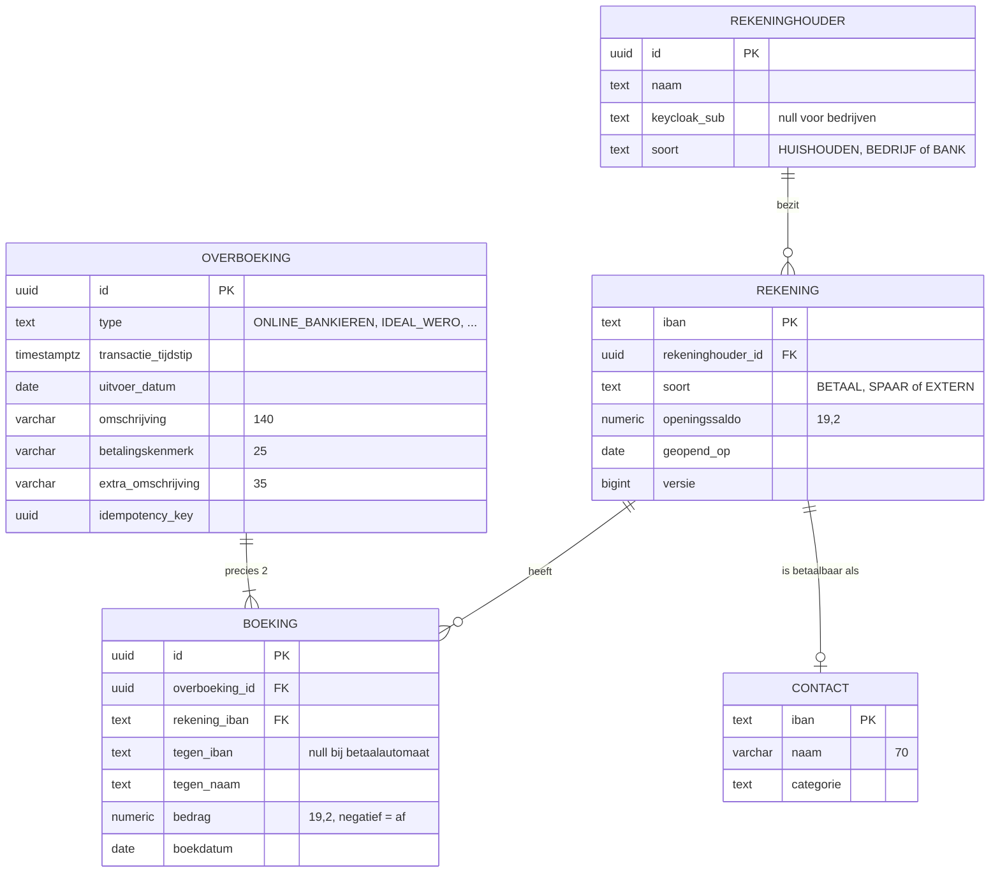
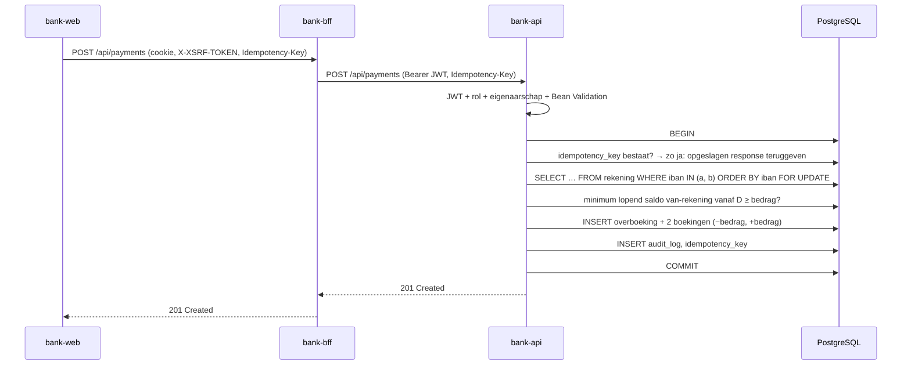
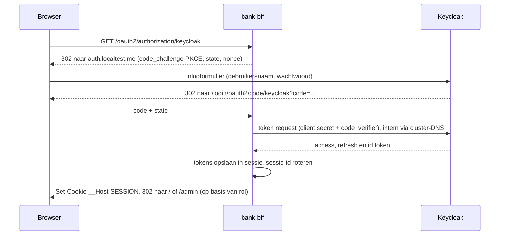

# BankSim – Technisch ontwerp

Dit document beschrijft hoe het [functioneel ontwerp](functioneel-ontwerp.md) (FO) wordt gebouwd: een Java 21 / Spring Boot backend, een Angular/TypeScript frontend, Keycloak voor identiteit en PostgreSQL voor opslag, draaiend in een lokaal kind-cluster. De harde uitgangspunten zijn: atomaire overboekingen, rekenen met `BigDecimal`, zero trust, OWASP Top 10:2025, bestand tegen uitval van netwerk en services, regressietests voor de backend en Playwright e2e-tests voor de frontend.

## 1. Uitgangspunten

### 1.1 Technologie

| Laag | Keuze | Versie |
| --- | --- | --- |
| Taal backend | Java | 21 (LTS) |
| Backend framework | Spring Boot, Spring Security, Spring Data JPA, Spring Modulith | Actuele stabiele 4.x bij implementatie |
| BFF / gateway | Spring Cloud Gateway (Server WebMVC) + Spring Security OAuth2 Client | Spring Cloud release-train passend bij Boot 4.x |
| Resilience | Resilience4j (+ `@Retryable`/`@ConcurrencyLimit` uit Spring Framework 7) | Actueel |
| Identiteit | Keycloak (via Keycloak Operator) | Actuele stabiele, minimaal 26 |
| Database | PostgreSQL via CloudNativePG-operator, migraties met Flyway | Minimaal 17 |
| Frontend | Angular (standalone components, signals), TypeScript strict | Actuele stabiele |
| Rekenen in frontend | `big.js` | Actueel |
| E2E-tests | Playwright (TypeScript) | Actueel |
| Backend-tests | JUnit 5, AssertJ, Testcontainers, jqwik, ArchUnit, Toxiproxy, PIT | Actueel |
| Platform | kind (lokaal), Istio ambient mesh, Gateway API, cert-manager | kind ≥ 0.31 |
| Build | Maven (backend), npm (frontend), Jib (images) | Maven 3.9, Node 22 LTS |

Versies worden niet in dit document vastgepind; de build gebruikt de Spring Boot BOM en een `package-lock.json`, zodat elke build reproduceerbaar is (zie A03 in hoofdstuk 11).

### 1.2 Belangrijkste ontwerpkeuzes

| Keuze | Waarom |
| --- | --- |
| Backend-for-Frontend (BFF) i.p.v. tokens in de browser | Geen access/refresh tokens in JavaScript; sessiecookie is HttpOnly. Aanbevolen patroon voor browser-apps met gevoelige data. |
| Eén grootboek: elke IBAN is een rekening | Elke geldbeweging heeft altijd twee kanten (af + bij) in dezelfde databasetransactie, ook bij betalingen aan bedrijven. |
| Saldo wordt berekend, niet opgeslagen | De simulatiedatum kan heen en weer; saldo = openingssaldo + som boekingen t/m die datum. |
| Bedragen als `BigDecimal` / `NUMERIC(19,2)` / JSON-string | Geen afrondingsfouten in Java, database of browser. |
| Migraties als aparte Job, JWKS lazy | De API start ook als database of Keycloak (nog) niet bereikbaar is en meldt zich dan alleen "niet ready". |
| Eén Angular-app met rol-afhankelijke routes | Het FO heeft één inlogscherm; de admin gebruikt de klantschermen in alleen-lezen modus. Eén host houdt het sessiecookie eenvoudig. |

## 2. Architectuur



| Component | Verantwoordelijkheid |
| --- | --- |
| `bank-web` | Angular-app, statisch geserveerd door nginx (unprivileged). Bevat alle schermen uit het FO. Doet zelf geen authenticatie: vraagt `/api/me` aan de BFF. |
| `bank-bff` | OIDC Authorization Code + PKCE met Keycloak als confidential client; bewaart tokens server-side in een gedeelde sessie (Spring Session JDBC in PostgreSQL, schema `bff`, token-attributen versleuteld met AES-GCM), zodat elke replica elke request kan afhandelen; zet HttpOnly/Secure/SameSite=Strict-cookie en CSRF-token; stuurt `/api/**` door naar `bank-api` met het access token (`TokenRelay`); rate limiting; na login redirect naar `/` (klant) of `/admin` (admin). |
| `bank-api` | Alle businesslogica en autorisatie. OAuth2 Resource Server: valideert elk JWT zelf (signatuur, issuer, audience `bank-api`, expiry). |
| Keycloak | Gebruikers, wachtwoorden, rollen `klant` en `admin`, brute-force-detectie, optioneel TOTP. |
| PostgreSQL | Grootboek, contacten, instellingen, audit log. |
| `bank-migrate` | Flyway-migraties als Kubernetes Job, vóór (her)deploy van de API. |
| `bank-datagen` | Deterministische generator van 5 jaar fake data + Keycloak-gebruikers (hoofdstuk 9). |

### 2.1 Repository-indeling

```text
banksim/
├── doc/                      functioneel- en technisch ontwerp
├── backend/                  Maven multi-module
│   ├── pom.xml               parent, Spring Boot BOM, plugin-versies
│   ├── bank-domain/          Money, Iban, ledger-regels (geen Spring-afhankelijkheden)
│   ├── bank-api/             REST API (Spring Modulith-modules)
│   ├── bank-bff/             Spring Cloud Gateway BFF
│   ├── bank-migrate/         Flyway-migraties + runner
│   └── bank-datagen/         fake data-generator
├── frontend/                 Angular workspace, app bank-web
│   └── src/app/{klant,admin,shared,core}
├── e2e/                      Playwright-tests
└── deploy/
    ├── kind/                 kind-cluster.yaml
    ├── platform/             cert-manager, Istio, CNPG, Keycloak operator
    └── banksim/              Helm-chart van de applicatie
```

## 3. Backend-ontwerp (`bank-api`)

### 3.1 Modules

Package-by-feature; Spring Modulith bewaakt in een test dat modules alleen via hun publieke API met elkaar praten.

| Module | Inhoud |
| --- | --- |
| `ledger` | `LedgerService`: de enige plek waar geld wordt geboekt; saldoberekening; locking |
| `account` | Rekeningen, overzicht, saldo op simulatiedatum |
| `transaction` | Transactielijst, zoeken, keyset-paginering, details |
| `payment` | Betalen naar contacten (validatie, idempotency) |
| `savings` | Inleggen/opnemen, rente (`InterestService`) |
| `contact` | Contactenlijst, suggesties |
| `simulation` | `SimulationClock`, simulatiedatum |
| `admin` | Rekeninghouders-overzicht, alleen-lezen inzage |
| `audit` | Audit-events vastleggen |
| `security` | JWT-configuratie, `CurrentUser`, eigenaarschapschecks |

### 3.2 REST API

Alle endpoints onder `/api`, JSON, OpenAPI 3.1-contract (`bank-api/src/main/resources/openapi.yaml`, contract-first). De Angular-client wordt uit dit contract gegenereerd. Bedragen zijn strings (`"1842.17"`), datums ISO-8601.

| Methode + pad | Rol | FO-scherm | Toelichting |
| --- | --- | --- | --- |
| `GET /api/me` | klant, admin | alle | Naam, rollen |
| `GET /api/me/accounts` | klant | Overzicht | Rekeningen met saldo op simulatiedatum |
| `GET /api/accounts/{iban}` | klant (eigenaar), admin | Betaal-/Spaarrekening | Kop: naam, IBAN, saldo; bij spaar ook lopende rente |
| `GET /api/accounts/{iban}/transactions` | klant (eigenaar), admin | Betaal-/Spaarrekening, Zoeken | Query: `cursor`, `size` (max 50), `q`, `min`, `max`, `type`, `direction=ALL\|OUT\|IN` |
| `GET /api/contacts?q=` | klant | Betalen | Max 10 suggesties op naam of IBAN |
| `POST /api/payments` | klant (eigenaar van van-rekening) | Betalen | Header `Idempotency-Key` verplicht |
| `POST /api/transfers` | klant (eigenaar van beide) | Overschrijven | Inleg/opname; `Idempotency-Key` verplicht |
| `GET /api/admin/simulation-date` | admin | Admin | Datum + toegestaan bereik |
| `PUT /api/admin/simulation-date` | admin | Admin | Wordt geaudit |
| `GET /api/admin/holders?q=` | admin | Admin | Overzicht rekeninghouders met saldi |
| `GET /api/admin/holders/{id}/accounts` | admin | Admin → Overzicht | Alleen-lezen |

Transactielijsten gebruiken **keyset-paginering** op `(transactie_tijdstip DESC, id DESC)`. De response bevat `items` en `nextCursor` (opaque, base64url, ondertekend met HMAC zodat de cursor niet te manipuleren is). Datumregels en jaartal-tussenregels maakt de frontend; "Toon meer" vraagt de volgende 50 met `nextCursor`, en verdwijnt als `nextCursor` leeg is.

Fouten volgen RFC 9457 (`ProblemDetail`):

```json
{
  "type": "https://banksim.local/problems/saldo-ontoereikend",
  "title": "Saldo ontoereikend",
  "status": 422,
  "detail": "Deze betaling zou het saldo onder € 0,00 brengen.",
  "correlationId": "7c1e…"
}
```

## 4. Datamodel

Elke IBAN in het systeem is een `rekening` in één grootboek: de betaal- en spaarrekeningen van de 10 huishoudens, maar ook de rekeningen van bedrijven (werkgever, supermarkt, energieleverancier, …) een interne renterekening en een kasrekening van BankSim (tegenrekening voor opnames bij de geldautomaat). Bedrijfsrekeningen hebben geen login, maar wel boekingen. Daardoor heeft elke geldbeweging altijd twee kanten.



Overige tabellen:

| Tabel | Doel |
| --- | --- |
| `idempotency_key` | `key`, `rekeninghouder_id`, `request_hash`, `response_status`, `response_body`, `aangemaakt_op`; uniek op (`key`, `rekeninghouder_id`) |
| `audit_log` | Wie, wat, wanneer, correlation-id; append-only (geen UPDATE/DELETE-rechten voor de applicatie-user) |
| `instelling` | `simulatiedatum`, `data_vanaf`, `data_tot` |

Constraints en indexen:

- `CHECK (bedrag <> 0)` op `boeking`; een deferred constraint-trigger controleert dat de som van de boekingen per `overboeking_id` precies 0 is en dat het er 2 zijn.
- Index `boeking (rekening_iban, boekdatum DESC, id DESC)` voor saldo en keyset-paginering.
- `pg_trgm` GIN-index op `tegen_naam` en `omschrijving` voor "Naam, bedrag, IBAN of omschrijving".
- Saldo op datum D: `openingssaldo + SUM(bedrag) WHERE rekening_iban = ? AND boekdatum <= D`.
- De applicatie-user heeft alleen DML-rechten; DDL alleen voor de migratie-user.

## 5. Geld en BigDecimal

Alle bedragen zijn `BigDecimal`, overal. `double`, `float` en `Number` worden nergens voor geld gebruikt.

```java
public record Money(BigDecimal amount) implements Comparable<Money> {
    public static final int SCALE = 2;
    public static final RoundingMode ROUNDING = RoundingMode.HALF_EVEN;

    public Money {
        Objects.requireNonNull(amount);
        if (amount.scale() > SCALE) {
            throw new IllegalArgumentException("Max. 2 decimalen");
        }
        amount = amount.setScale(SCALE, ROUNDING);
    }
    public static Money of(String value) { return new Money(new BigDecimal(value)); }
    public Money plus(Money other)  { return new Money(amount.add(other.amount)); }
    public Money minus(Money other) { return new Money(amount.subtract(other.amount)); }
    public Money negate()           { return new Money(amount.negate()); }
    public boolean isNegative()     { return amount.signum() < 0; }
    @Override public int compareTo(Money o) { return amount.compareTo(o.amount); }
}
```

| Plaats | Regel |
| --- | --- |
| Domein | `Money` (scale 2, `HALF_EVEN`); vergelijken met `compareTo`, nooit `equals` op `BigDecimal` |
| Rente | Tussenresultaten op scale 10 met `MathContext.DECIMAL128`; pas bij het boeken afronden naar scale 2 |
| Database | `NUMERIC(19,2)`; Hibernate-mapping op `BigDecimal` |
| JSON | Jackson schrijft/leest bedragen als string (`"-63.48"`); invoer met meer dan 2 decimalen → 400 |
| Frontend | Bedragen blijven strings of `Big` (`big.js`); invoer met komma wordt genormaliseerd; weergave als `1.842,17` via een eigen `MoneyPipe` op basis van `Big`, niet via `Number` |
| Bewaking | ArchUnit-regel: geen velden, parameters of returntypes `double`/`float`/`Double`/`Float` in `..domain..`, `..ledger..`, `..payment..`, `..savings..`; ESLint-regel in de frontend die `parseFloat`/`Number()` in `money/` verbiedt |

## 6. Overboekingen en transactionaliteit

Alle geldbewegingen lopen via één methode: `LedgerService.boek(...)`. Dat geldt voor betalingen naar bedrijven, betalingen tussen huishoudens, inleg en opname op de spaarrekening en rente. De generator gebruikt dezelfde domeinregels. Afschrijving en bijschrijving gebeuren altijd in **dezelfde databasetransactie**: er wordt nooit afgeschreven zonder dat de doelrekening is bijgeschreven.



```java
@Transactional(isolation = Isolation.READ_COMMITTED, timeout = 5)
public Overboeking boek(BoekOpdracht opdracht) {
    var rekeningen = rekeningRepository.lockInVasteVolgorde(
            opdracht.van(), opdracht.naar());          // SELECT … ORDER BY iban FOR UPDATE
    var van = rekeningen.get(opdracht.van());
    var naar = rekeningen.get(opdracht.naar());

    if (van.magNietRoodStaan()) {                      // BETAAL en SPAAR; EXTERN niet
        Money minimum = saldoQuery.minimumLopendSaldoVanaf(van.iban(), opdracht.boekdatum());
        if (minimum.minus(opdracht.bedrag()).isNegative()) {
            throw new SaldoOntoereikendException(van.iban());
        }
    }
    var overboeking = Overboeking.nieuw(opdracht);
    boekingRepository.saveAll(List.of(
            Boeking.af(overboeking, van, naar, opdracht.bedrag()),
            Boeking.bij(overboeking, naar, van, opdracht.bedrag())));
    audit.vastleggen(AuditEvent.overboeking(overboeking));
    return overboeking;
}
```

Regels:

- **Locking**: beide rekeningen worden met `SELECT … FOR UPDATE` vergrendeld, altijd in IBAN-volgorde, zodat twee gelijktijdige overboekingen A→B en B→A geen deadlock geven.
- **Nooit rood staan**: de generator heeft al boekingen na de simulatiedatum D gemaakt. Daarom controleert de service niet alleen het saldo op D, maar het **minimum van het lopende saldo vanaf D** (window-functie over boekingen ≥ D). Zo kan een betaling op D er niet voor zorgen dat de rekening later alsnog negatief komt. Bij inleg/opname gebeurt deze controle als laatste stap, ná de rentecorrecties (hoofdstuk 7), want minder rente kan een latere opname onder nul brengen.
- **Spaarrekening**: opnemen kan alleen tot het saldo; inleggen alleen tot het saldo van de betaalrekening. De betaalrekening ziet type `Overschrijving`, de spaarrekening type `Inleg` of `Opname`.
- **Idempotency**: `Idempotency-Key` (UUID, door de frontend per formulierverzending gemaakt) wordt in dezelfde transactie opgeslagen. Een herhaald verzoek met dezelfde key en dezelfde inhoud krijgt de opgeslagen response terug; met andere inhoud volgt 422. Zo zijn retries na een netwerkfout veilig.
- **Database-garantie**: de deferred constraint-trigger (hoofdstuk 4) weigert een commit waarbij een overboeking niet uit precies twee boekingen met som 0 bestaat.
- **Fouten**: elke exception binnen `boek` leidt tot een rollback; er blijft nooit een halve overboeking achter.
- **Tijdstip**: transactie_tijdstip = simulatiedatum D + huidige tijd (Europe/Amsterdam); uitvoer_datum = D.

## 7. Rente

| Regel | Uitwerking |
| --- | --- |
| Percentage | Vast 3% per jaar |
| Berekening | Dagelijks over het eindsaldo van de dag: `saldo × 0,03 / dagen-in-jaar` (365 of 366), scale 10 |
| Bijschrijving | Op de laatste dag van elke maand, afgerond op 2 decimalen (`HALF_EVEN`), als overboeking van de BankSim-renterekening naar de spaarrekening, type `Rente` |
| Lopende rente | Wordt bij `GET /api/accounts/{iban}` on-the-fly berekend van de 1e van de maand t/m D en apart getoond |
| Herberekening | Na elke inleg of opname herberekent `InterestService` in dezelfde transactie de rente van de betreffende maand en alle latere maanden van die spaarrekening. Verschillen worden via `LedgerService` geboekt als correctieboeking (type `Rente`, omschrijving "Rentecorrectie"); bestaande boekingen worden nooit verwijderd of gewijzigd |

## 8. Simulatiedatum

- `SimulationClock` vervangt overal `LocalDate.now()`. Een ArchUnit-regel verbiedt `now()` zonder `Clock` in domeincode.
- De datum staat in `instelling` en wordt met een korte TTL (5 s) gecachet.
- Alle queries filteren op `boekdatum <= D`: transactielijst, zoeken, saldo, admin-overzicht.
- Het bereik is beperkt tot `data_vanaf` (1-10-2021) t/m `data_tot` (31-12-2026). "Terug naar vandaag" zet D op de systeemdatum binnen dat bereik.
- Boekingen worden nooit verwijderd door het verzetten van de datum; ze zijn alleen onzichtbaar na D.

## 9. Fake data-generator (`bank-datagen`)

- Draait als Kubernetes Job (en lokaal als CLI), schrijft via bulk-insert (`COPY`) naar PostgreSQL.
- **Deterministisch**: vaste seed → steeds dezelfde data. Dit is ook de basis voor de e2e-tests.
- Maakt de 10 huishoudens met profielen en het transactiepatroon uit het FO, plus de bedrijven met geldige NL-IBAN's (mod-97-checksum, fictieve bankcode `SIMB`). Alle IBAN's die betaalbaar zijn komen in `contact`.
- Boekt in memory via dezelfde `bank-domain`-regels als `LedgerService`: double-entry, nooit rood (bij een tekort eerst een opname van de spaarrekening of een niet-vaste uitgave overslaan), maandelijkse rente.
- Maakt een `KeycloakRealmImport` met 10 klanten en 1 admin; wachtwoorden komen uit een Kubernetes Secret dat bij installatie wordt gegenereerd, niet uit Git.
- Controleert aan het eind de invarianten (som van alle boekingen = 0, geen negatief betaal- of spaarsaldo) en schrijft een checksum van de eindsaldi (golden master).

## 10. Security en zero trust

Uitgangspunt: geen enkele verbinding wordt vertrouwd omdat hij "van binnen" komt. Elke stap authenticeert en autoriseert opnieuw.

### 10.1 Lagen

| Laag | Maatregel |
| --- | --- |
| Browser → cluster | Alleen HTTPS (TLS-certificaat van cert-manager met lokale CA), HSTS; HTTP wordt alleen omgeleid |
| Browser → BFF | Sessiecookie `__Host-SESSION` (HttpOnly, Secure, SameSite=Strict, Path=/); CSRF via `XSRF-TOKEN`-cookie + `X-XSRF-TOKEN`-header (Angular `HttpClient` ondersteunt dit standaard); sessie-timeout 15 min inactief, max 8 uur |
| BFF → API | Access token (JWT, 5 min geldig) via `TokenRelay`; API valideert signatuur, `iss`, `aud=bank-api`, `exp`, `nbf` |
| Pod ↔ pod | Istio ambient: mTLS met SPIFFE-identiteit per service-account; `AuthorizationPolicy` met default-deny; alleen toegestaan: gateway→web, gateway→bff, gateway→keycloak, bff→api, bff→keycloak, bff→postgres (sessies), api→keycloak, api→postgres, migrate/datagen→postgres, datagen→keycloak |
| Netwerk | Kubernetes `NetworkPolicy` default-deny (ingress en egress) per namespace, met expliciete allow-regels; DNS, de Istio HBONE-poort 15008 en de kubelet-probes (in ambient mode gesnat naar `169.254.7.127/32`) worden expliciet toegestaan, anders wordt geen enkele pod ready |
| API → PostgreSQL | TLS `sslmode=verify-full` met de CA van CloudNativePG; aparte DB-users voor api (DML), bff (alleen schema `bff`) en migratie (DDL) |
| Secrets | Kubernetes Secrets, gegenereerd bij installatie; nooit in Git, images of logs |

### 10.2 Inloggen



Keycloak gebruikt `KC_HOSTNAME=https://auth.localtest.me` met dynamisch backchannel. `auth.localtest.me` wijst binnen een pod naar 127.0.0.1, dus BFF en API gebruiken die host alleen voor de browser-redirect en praten verder via cluster-DNS met Keycloak. Daarom configureert de BFF de provider expliciet in plaats van met `issuer-uri` (geen discovery bij startup):

```yaml
spring.security.oauth2.client.provider.keycloak:
  authorization-uri: https://auth.localtest.me/realms/banksim/protocol/openid-connect/auth
  token-uri:         https://keycloak-service.banksim.svc:8443/realms/banksim/protocol/openid-connect/token
  jwk-set-uri:       https://keycloak-service.banksim.svc:8443/realms/banksim/protocol/openid-connect/certs
  user-info-uri:     https://keycloak-service.banksim.svc:8443/realms/banksim/protocol/openid-connect/userinfo
  user-name-attribute: preferred_username
```

BFF en API valideren de issuer tegen de publieke URL `https://auth.localtest.me/realms/banksim`, zodat die overal gelijk is. Een audience-mapper in de client scope zet `bank-api` in `aud`.

### 10.3 Autorisatie in de API

- `@PreAuthorize("hasRole('klant')")` / `hasRole('admin')` op elke controller-methode; ontbreekt een annotatie, dan faalt een ArchUnit-test (deny by default).
- **Eigenaarschap**: voor de rol `klant` krijgt elke rekening-query de `keycloak_sub` van de ingelogde gebruiker mee (`WHERE r.iban = :iban AND h.keycloak_sub = :sub`). Een onbekende of andermans IBAN geeft 404, geen 403, zodat het bestaan niet uitlekt.
- **Uitzondering admin**: de admin mag rekeningen van alle huishoudens lezen (`h.soort = 'HUISHOUDEN'`), maar niet de grootboekrekeningen van bedrijven en BankSim. Deze uitzondering zit in één aparte query-methode met eigen tests.
- **Admin is alleen-lezen**: admin-endpoints zijn GET, behalve `PUT /simulation-date`. `POST /payments` en `/transfers` vereisen rol `klant` en eigenaarschap; de admin kan dus nooit namens een klant betalen.
- Betalen kan alleen naar een IBAN in `contact`, en de naam moet bij dat contact passen. Dit wordt server-side gecontroleerd, niet alleen in de UI.

### 10.4 Frontend-hardening

- Content-Security-Policy via nginx: `default-src 'self'; script-src 'self'; style-src 'self' 'nonce-…'; img-src 'self' data:; connect-src 'self'; frame-ancestors 'none'; base-uri 'none'; form-action 'self' https://auth.localtest.me`. Angular `autoCsp` / `ngCspNonce`.
- Overige headers: `X-Content-Type-Options: nosniff`, `Referrer-Policy: no-referrer`, `Permissions-Policy` restrictief.
- Geen `innerHTML`/`bypassSecurityTrust*`; Angular escapet standaard. ESLint-regels bewaken dit.

## 11. OWASP Top 10:2025

| Categorie | Maatregelen in BankSim |
| --- | --- |
| **A01 Broken Access Control** | Deny-by-default (`@PreAuthorize` verplicht, ArchUnit-test); eigenaarschapscheck in elke query (IDOR); admin alleen-lezen; HMAC-ondertekende cursors; CORS uit (alles via één origin); e2e- en integratietests op toegang tot andermans IBAN en admin-URL's als klant |
| **A02 Security Misconfiguration** | Actuator alleen `health` op aparte management-poort, niet via de Gateway; geen standaardwachtwoorden (Secrets gegenereerd); security headers; containers non-root, `readOnlyRootFilesystem`, `drop: [ALL]`, `seccompProfile: RuntimeDefault`; foutmeldingen zonder stacktraces; Keycloak-admin-console niet via de Gateway bereikbaar |
| **A03 Software Supply Chain Failures** | Versies via Spring Boot BOM en `package-lock.json` (`npm ci`); OWASP Dependency-Check en `npm audit` in CI met drempel; CycloneDX-SBOM voor backend, frontend en images; Trivy-scan van images; base-images op digest gepind; Renovate voor updates; alleen Maven Central en npmjs |
| **A04 Cryptographic Failures** | TLS overal (ingress, mTLS in de mesh, PostgreSQL verify-full); geen eigen crypto; wachtwoord-hashing door Keycloak (Argon2/PBKDF2); JWT RS256/ES256 met sleutelrotatie in Keycloak; geen gevoelige data in URL's of logs |
| **A05 Injection** | Alleen geparametriseerde queries (Spring Data JPA, Criteria/Specification voor zoeken, geen string-concatenatie in SQL); Bean Validation op alle invoer (lengtes uit het FO: 70/34/140/25/35); IBAN-checksum; Angular-templates escapen; geen dynamische HTML |
| **A06 Insecure Design** | Threat model (STRIDE) per flow; businessregels alleen server-side (nooit rood, alleen contacten, bedragen > 0); idempotency; transactielimieten en rate limiting (Bucket4j in de BFF met PostgreSQL-backend, dus gedeeld over replicas: login, betalen); double-entry met databaseconstraint als laatste verdedigingslinie |
| **A07 Authentication Failures** | Keycloak: brute-force-detectie, wachtwoordbeleid, optioneel TOTP-MFA; sessie-id rotatie na login; korte access tokens (5 min) met refresh-token-rotatie; uitloggen trekt ook de Keycloak-sessie in (RP-initiated logout) |
| **A08 Software or Data Integrity Failures** | JWT-signatuur altijd gevalideerd (geen `alg=none`); geen Java-deserialisatie van onbetrouwbare data; Flyway-checksums; audit log append-only; images bouwen met Jib (reproduceerbaar) en optioneel ondertekenen met cosign |
| **A09 Security Logging and Alerting Failures** | `audit_log` voor login-gerelateerde events (via Keycloak-events), betalingen, overschrijvingen, wijziging simulatiedatum en geweigerde toegang; gestructureerde JSON-logs met correlation-id, zonder tokens, wachtwoorden of volledige IBAN's (gemaskeerd); Micrometer-metrics op mislukte logins en 403/404-pieken met een alert-regel |
| **A10 Mishandling of Exceptional Conditions** | Centrale `@RestControllerAdvice` → `ProblemDetail`, nooit interne details; fail-closed (bij twijfel weigeren, bv. JWKS onbekend → 401); transacties rollen volledig terug; timeouts op alle uitgaande calls; geen lege `catch`-blokken (Error Prone / Sonar-regel); tests voor foutpaden (DB weg, Keycloak weg) |

## 12. Resilience

De backend moet blijven werken, of netjes en veilig falen, als het netwerk, de database of Keycloak niet beschikbaar is.

### 12.1 Opstarten zonder afhankelijkheden

- Migraties draaien in de Job `bank-migrate`, niet bij het opstarten van de API.
- API en BFF gebruiken expliciete endpoints (`jwk-set-uri`, `token-uri`, …) in plaats van `issuer-uri`, dus geen discovery bij startup (hoofdstuk 10.2).
- De BFF-sessiestore (PostgreSQL) wordt pas bij het eerste verzoek benaderd; zonder database werkt inloggen tijdelijk niet, maar de pod start wel.
- Geen databasecalls in `@PostConstruct` of `ApplicationRunner`.
- Gevolg: de pod start altijd. De **startupProbe** wacht tot de JWKS één keer is opgehaald en de database één keer bereikbaar was; daarna is de pod ready. **Liveness** is alleen "proces leeft".
- Een latere storing van database of Keycloak maakt pods bewust **niet** unready: dan zou Kubernetes alle pods tegelijk uit de service halen en krijgt de gebruiker een generieke 503 van de gateway in plaats van de ontworpen foutmelding. De pods blijven bereikbaar en geven zelf een nette `ProblemDetail` terug (zie tabel).

### 12.2 Tijdens gebruik

| Afhankelijkheid | Maatregel | Gedrag bij uitval |
| --- | --- | --- |
| PostgreSQL | HikariCP `connectionTimeout` 3 s, `validationTimeout` 1 s; `statement_timeout` 5 s; transactie-timeout 5 s; pool als bulkhead | 503 `ProblemDetail` met `Retry-After`; geen halve boekingen (rollback); pod blijft ready |
| Keycloak (JWKS) | Sleutels gecachet (Spring Cache, 10 min); ophalen met timeout 2 s en circuit breaker; bij onbekende `kid` één keer verversen | Bestaande tokens blijven valideerbaar; onbekende sleutel → 401 (fail closed) |
| Keycloak (BFF: login/refresh) | Timeout 3 s, circuit breaker | Nieuwe logins tijdelijk niet mogelijk ("Inloggen is tijdelijk niet mogelijk"); bestaande sessies werken tot het token verloopt |
| BFF → API | Resilience4j via Spring Cloud CircuitBreaker-filter: timeout 5 s, retry (max 2, exponentiële backoff met jitter) **alleen voor GET**, circuit breaker | Frontend toont foutmelding met "Opnieuw proberen" |
| POST betalen/overschrijven | Geen automatische retry in de BFF; de frontend mag opnieuw proberen met dezelfde `Idempotency-Key` | Nooit dubbel geboekt |

Overig:

- Virtual threads (`spring.threads.virtual.enabled=true`); de connection pool begrenst de belasting van de database.
- Graceful shutdown (`server.shutdown=graceful`, 20 s) en een `preStop`-pauze, zodat lopende transacties afronden.
- Minimaal 2 replicas voor `bank-api` en `bank-bff`, `PodDisruptionBudget` `minAvailable: 1`, `topologySpreadConstraints` over nodes (relevant in `multi-node-cluster`).
- De frontend gebruikt een `HttpInterceptor` die 503 en netwerkfouten vertaalt naar een duidelijke melding en een retry-knop; formulieren behouden hun invoer.

## 13. Teststrategie backend (regressie)

Doel: elke toekomstige wijziging die bestaand gedrag breekt, faalt in de build.

| Niveau | Tooling | Wat wordt getest |
| --- | --- | --- |
| Unit | JUnit 5, AssertJ | `Money`, IBAN-validatie, renteberekening, validatieregels, mapping |
| Property-based | jqwik | Geld: `a + b − b = a`, nooit meer dan 2 decimalen; ledger: som van alle saldi blijft gelijk na willekeurige reeksen overboekingen; nooit negatief saldo; rente is monotoon in saldo |
| Slice | `@WebMvcTest` + `jwt()`, `@DataJpaTest` | Elke endpoint: 401 zonder token, 403 met verkeerde rol, 404 op andermans IBAN, validatiefouten 400/422; repository-queries (keyset, zoeken, saldo op datum) |
| Integratie | Testcontainers (PostgreSQL, Keycloak), `@SpringBootTest` | Volledige flows: betalen, inleggen/opnemen, admin-simulatiedatum; echte JWT's van Keycloak; Flyway-migraties op een lege en een gevulde DB |
| Concurrency | Testcontainers + `ExecutorService` | 100 gelijktijdige overboekingen kriskras tussen rekeningen: geen deadlocks, geen negatief saldo, totaal ongewijzigd |
| Idempotency | Integratie | Dezelfde `Idempotency-Key` 2× → 1 boeking; andere inhoud → 422 |
| Resilience | Toxiproxy (Testcontainers) | DB-verbinding wegvallen midden in een overboeking → rollback, 503 `ProblemDetail`; latency → timeout; Keycloak weg → bestaande tokens werken; API en BFF starten zonder DB/Keycloak en worden ready zodra die er zijn |
| Architectuur | Spring Modulith `verify()`, ArchUnit | Modulegrenzen; geen `double`/`float` in geld-code; `@PreAuthorize` op elke endpoint; geen `LocalDate.now()` zonder `SimulationClock`; alleen `LedgerService` schrijft boekingen |
| Contract | OpenAPI-diff (openapi-diff-maven-plugin) | Breaking changes in de API laten de build falen |
| Golden master | Generator met vaste seed | Checksum van eindsaldi en aantal transacties per rekening ongewijzigd |
| Kwaliteit | JaCoCo (≥ 85% line, ≥ 80% branch op `bank-domain`/`ledger`), PIT mutation testing (≥ 75% op `bank-domain`) | Tests vangen echt gedrag af |

Voorbeeld concurrency-test:

```java
@Test
void gelijktijdigeOverboekingenHoudenTotaalGelijkEnNooitRood() throws Exception {
    Money totaalVoor = saldoQuery.totaalVanAlleRekeningen(vandaag);
    try (var executor = Executors.newVirtualThreadPerTaskExecutor()) {
        var taken = IntStream.range(0, 100)
                .mapToObj(i -> (Callable<Object>) () -> probeer(() -> ledger.boek(willekeurigeOpdracht(i))))
                .toList();
        executor.invokeAll(taken);
    }
    assertThat(saldoQuery.totaalVanAlleRekeningen(vandaag)).isEqualByComparingTo(totaalVoor);
    assertThat(saldoQuery.laagsteSaldoHuishoudens()).isGreaterThanOrEqualTo(Money.of("0.00"));
}
```

Alle tests draaien in `mvn verify`; Testcontainers gebruikt de lokale Docker.

## 14. Playwright e2e-tests

- Map `e2e/`, TypeScript, page objects per FO-scherm (`LoginPage`, `OverzichtPage`, `BetaalrekeningPage`, `BetalenPage`, `SpaarrekeningPage`, `OverschrijvenPage`, `AdminPage`).
- Twee Playwright-projects voor de klant- en de admin-frontend, elk met een eigen ingelogde `storageState` (aangemaakt in een setup-project dat via het echte Keycloak-inlogscherm inlogt). Browsers: Chromium, Firefox, WebKit.
- Draait tegen de deployment in kind (`baseURL: https://bank.localtest.me`, lokale CA vertrouwd). Vóór de suite zet `globalSetup` de testdata terug door de `bank-datagen` Job opnieuw te draaien (vaste seed) en de simulatiedatum op een vaste datum te zetten. Er bestaan geen test-only endpoints in de applicatie.
- Selectors via `getByRole`/`getByLabel` (dwingt toegankelijke markup af); `data-testid` alleen waar nodig.
- Bij falen: trace, screenshot en video als artefact.

| Scenario | Controle |
| --- | --- |
| Inloggen klant | Komt op Overzicht met betaal- en spaarrekening en saldi |
| Inloggen admin | Komt op Admin scherm |
| Verkeerd wachtwoord | Foutmelding; na N pogingen geblokkeerd (Keycloak brute force) |
| Betaalrekening | Kop toont naam, IBAN, saldo; datumregels; bedragen met teken |
| Toon meer | Eerst 50 regels, daarna 100; knop verdwijnt aan het eind |
| Uitklappen | Details: naam, transactietype, Van/Naar met IBAN, "3 oktober 2026 om 13:26", uitgevoerd op; Betaalautomaat zonder Naar-IBAN |
| Zoeken | Knop wordt "Verberg zoeken"; filter op tekst, bedrag van/t/m, type, in/uit; Wissen zet alles terug; ongeldig bereik geeft melding |
| Betalen | Suggesties uit contacten; max-lengtes 70/34/140/25/35; onbekend IBAN geweigerd; controlescherm + bevestigen; transactie bovenaan; saldo verlaagd |
| Rood staan | Bedrag hoger dan saldo wordt geweigerd |
| Betalen tussen huishoudens | Ontvanger (tweede klant) ziet de bijschrijving |
| Spaarrekening | Jaartal-tussenregel; details met Datum, Tegenrekening, Type; lopende rente zichtbaar |
| Inleggen/Opnemen | Overschrijven-scherm met juiste Van/Naar; beide saldi kloppen na afloop |
| Simulatiedatum | Admin zet datum terug → klant ziet geen latere transacties en saldo van die dag; vooruit → weer zichtbaar |
| Admin alleen-lezen | Admin ziet transacties van een klant; Betalen/Opnemen/Inleggen niet zichtbaar |
| Toegangscontrole | Klant op `/admin` → geweigerd; klant opent andermans IBAN-URL → niet gevonden |
| Resilience | API geschaald naar 0 → nette foutmelding en "Opnieuw proberen"; na herstel werkt het weer |
| Uitloggen | Sessie weg; terugknop toont geen gegevens |

## 15. Deployment op kind

### 15.1 Cluster

Een eigen cluster `banksim` met poorten naar de host (de bestaande clusters `single-node` en `multi-node-cluster` blijven ongemoeid):

```yaml
# deploy/kind/kind-cluster.yaml
kind: Cluster
apiVersion: kind.x-k8s.io/v1alpha4
name: banksim
nodes:
  - role: control-plane
    extraPortMappings:
      - containerPort: 30080   # Istio Gateway HTTP (NodePort)
        hostPort: 80
      - containerPort: 30443   # Istio Gateway HTTPS (NodePort)
        hostPort: 443
  - role: worker
  - role: worker
```

`*.localtest.me` verwijst naar 127.0.0.1, dus geen `/etc/hosts`-aanpassing nodig. kind v0.31 gebruikt kindnet, dat `NetworkPolicy` afdwingt; een rooktest na installatie controleert dat een pod zonder toestemming `bank-api` niet kan bereiken.

### 15.2 Installatievolgorde

1. Gateway API CRD's, cert-manager + lokale CA (`ClusterIssuer`)
2. Istio (profiel `ambient`), namespace `banksim` met label `istio.io/dataplane-mode=ambient`
3. CloudNativePG-operator → `Cluster` `bank-db` (TLS, users `bank_app` en `bank_migrate`)
4. Keycloak Operator → `Keycloak` + `KeycloakRealmImport` (realm `banksim`, clients `bank-bff` confidential)
5. Job `bank-migrate` (Flyway)
6. Job `bank-datagen` (data + Keycloak-gebruikers)
7. Helm-chart `banksim`: `bank-api`, `bank-bff`, `bank-web`, `Gateway`/`HTTPRoute`, `AuthorizationPolicy`, `NetworkPolicy`, `PodDisruptionBudget`

### 15.3 Images en pods

- Backend-images met Jib (distroless Java 21, non-root), frontend-image op `nginx-unprivileged`; laden met `kind load docker-image --name banksim`.
- Elke pod: `runAsNonRoot`, `readOnlyRootFilesystem`, `allowPrivilegeEscalation: false`, `capabilities.drop: [ALL]`, `seccompProfile: RuntimeDefault`, `automountServiceAccountToken: false` (behalve waar nodig), eigen service-account per component.
- Resources: requests/limits per pod; probes: `startupProbe` op een health group `startup` (DB één keer bereikt, JWKS één keer geladen), `livenessProbe` op `/actuator/health/liveness`, `readinessProbe` op `/actuator/health/readiness` (zonder externe afhankelijkheden) (management-poort 8081, niet via de Gateway).
- Configuratie via ConfigMaps; geheimen (DB-wachtwoorden, client secret, HMAC-sleutel cursors, Keycloak-wachtwoorden) via Secrets.

## 16. Build en CI

Lokaal één `Makefile` met targets `cluster`, `platform`, `build`, `test`, `deploy`, `e2e`. Pipeline (bijv. GitHub Actions) in deze volgorde:

1. `mvn verify` (unit, slice, integratie, architectuur, contract, JaCoCo, PIT op `bank-domain`)
2. `npm ci && npm run lint && npm test && npm run build` (frontend)
3. Dependency-Check, `npm audit`, CycloneDX-SBOM
4. Images bouwen (Jib, Docker), Trivy-scan, optioneel cosign
5. kind-cluster opzetten, deployen, Playwright e2e
6. Artefacten: testrapporten, SBOM's, Playwright-traces

## 17. Open punten

- [ ] Is TOTP-MFA verplicht voor de admin (aanbevolen), en ook voor klanten?
- [ ] Istio ambient of Linkerd als mesh? Dit ontwerp kiest Istio ambient (volledig open source, ook Gateway API-implementatie).
- [ ] Helm of Kustomize voor de applicatie-manifests? Dit ontwerp kiest Helm.
- [ ] Welke transactielimiet per betaling/dag (bovenop "nooit rood")?
